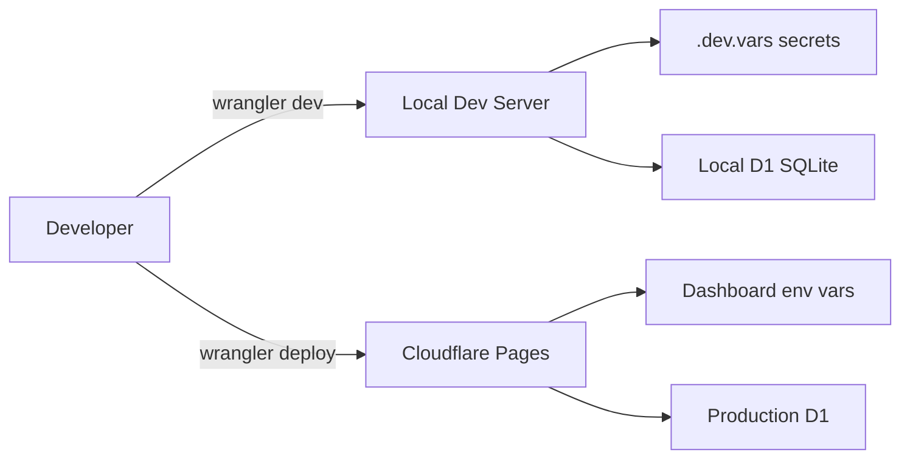

# Phase 01: Environment Setup

## Context Links

- **Parent Plan**: [Migration Plan](./plan.md)
- **Next Phase**: [Phase 02: Database Schema](./phase-02-database-schema.md)
- **Research**: [Pages Deployment](./research/researcher-01-pages-deployment.md)

## Overview

Set up Cloudflare account, install wrangler CLI, initialize project bindings, configure local development environment.

**Priority**: P0 (critical blocker for all other phases)
**Status**: pending
**Effort**: 2 hours
**Date**: 2026-01-18

## Key Insights

- Wrangler CLI is official Cloudflare dev tool for Pages, Workers, D1, KV, R2
- Local development requires `.dev.vars` for secrets (never commit)
- Bindings defined in `wrangler.toml` map to env context in Pages Functions
- Pages auto-detects Next.js framework, minimal config needed
- Free tier: 100k Functions requests/day, 10GB D1 storage, 5GB R2 storage

## Requirements

### Functional
- Cloudflare account with verified email
- Wrangler CLI installed globally or via npx
- Git repository connected to Cloudflare Pages
- `.dev.vars` file for local secrets
- `wrangler.toml` with basic project config

### Non-Functional
- CLI version >= 3.0 for D1 support
- Node.js >= 18 for compatibility_flags nodejs_compat
- Git branch strategy: main = production, staging = preview

## Architecture



## Related Code Files

### To Create
- `/wrangler.toml` - Project configuration
- `/.dev.vars` - Local environment secrets
- `/.gitignore` - Add Cloudflare patterns

### To Modify
- None (setup phase)

### To Delete
- None

## Implementation Steps

1. **Create Cloudflare Account**
   ```bash
   # Visit https://dash.cloudflare.com/sign-up
   # Verify email, complete onboarding
   ```

2. **Install Wrangler CLI**
   ```bash
   npm install -g wrangler@latest
   # Or use npx for project-local: npx wrangler@latest
   wrangler --version  # Verify >= 3.0
   ```

3. **Authenticate Wrangler**
   ```bash
   wrangler login
   # Opens browser, authorize access
   # Verify: wrangler whoami
   ```

4. **Initialize Pages Project**
   ```bash
   cd /Users/mbpprm/Documents/mybuild/for-free/premium-bio-website
   wrangler pages project create premium-bio-website
   # Select production branch: main
   # Select framework: Next.js
   ```

5. **Create wrangler.toml**
   ```toml
   name = "premium-bio-website"
   compatibility_date = "2024-01-01"
   compatibility_flags = ["nodejs_compat"]
   pages_build_output_dir = "./out"

   # Bindings will be added in subsequent phases
   # [[d1_databases]] - Phase 02
   # [[kv_namespaces]] - Phase 03
   # [[r2_buckets]] - Phase 04
   ```

6. **Create .dev.vars (local secrets)**
   ```env
   ADMIN_SECRET=your_secure_admin_secret
   DOMAIN=localhost
   NODE_ENV=development
   ```

7. **Update .gitignore**
   ```gitignore
   # Add Cloudflare patterns
   .dev.vars
   .wrangler/
   wrangler.toml.bak
   ```

8. **Connect Git Repository**
   ```bash
   # In Cloudflare Dashboard: Workers & Pages > Create > Connect to Git
   # Select GitHub repo: LaBanHSPO/premium-bio-website
   # Configure build:
   #   Build command: npm run build
   #   Output directory: out
   #   Root directory: /
   ```

9. **Test Local Development**
   ```bash
   npm run build
   npx wrangler pages dev ./out
   # Should serve on http://localhost:8788
   # Ctrl+C to stop
   ```

10. **Verify Setup**
    ```bash
    # Check wrangler can access account
    wrangler whoami

    # List Pages projects
    wrangler pages project list

    # Verify premium-bio-website exists
    ```

## Todo List

- [ ] Create Cloudflare account and verify email
- [ ] Install wrangler CLI (npm install -g wrangler@latest)
- [ ] Authenticate wrangler (wrangler login)
- [ ] Create Pages project (wrangler pages project create premium-bio-website)
- [x] Create wrangler.toml with basic config
- [x] Create .dev.vars with ADMIN_SECRET and DOMAIN
- [x] Update .gitignore with Cloudflare patterns
- [ ] Connect GitHub repo to Cloudflare Pages dashboard
- [ ] Test local build and dev server (npx wrangler pages dev ./out)
- [ ] Verify wrangler whoami and pages project list

## Critical Fixes Required (Code Review)

✅ **ALL CRITICAL FIXES RESOLVED**

- [x] **CRITICAL**: Regenerate ADMIN_SECRET with crypto.randomBytes(32).toString('base64')
  - Generated: +aeKvXrh99vqt+kKSOWglP7H41Q2Dm6OHaEfyuIUTdw= (32-byte base64)
- [x] **CRITICAL**: Remove account_id from wrangler.toml line 2
  - Removed: No account_id in current wrangler.toml
- [x] **CRITICAL**: Fix pages_build_output_dir to "./out" in wrangler.toml
  - Fixed: pages_build_output_dir = "./out" (line 4)
- [x] **CRITICAL**: Add output: 'export' to next.config.js
  - Added: output: 'export' (line 3)
- [ ] **OPTIONAL**: Add wrangler to devDependencies in package.json
  - Medium priority: Team workflow improvement
- [ ] **OPTIONAL**: Update compatibility_date to "2026-01-01"
  - Medium priority: Non-blocking, can update anytime

## Success Criteria

- [ ] Wrangler CLI installed and authenticated
- [ ] Pages project created in Cloudflare dashboard
- [ ] wrangler.toml exists with basic config
- [ ] .dev.vars created (not committed)
- [ ] .gitignore updated with Cloudflare patterns
- [ ] Git repo connected to Pages (visible in dashboard)
- [ ] Local dev server runs without errors (http://localhost:8788)
- [ ] `wrangler pages project list` shows premium-bio-website

## Risk Assessment

| Risk | Impact | Mitigation |
|------|--------|-----------|
| Wrangler version incompatibility | High | Use latest version >= 3.0, check compatibility_date |
| Git connection fails | Medium | Manual deploy via CLI as fallback |
| Local dev server errors | Low | Use npm run dev as fallback during setup |
| Account verification delays | Low | Complete verification early, check spam folder |

## Security Considerations

- **Never commit .dev.vars** to git (contains secrets)
- **Use strong ADMIN_SECRET** (min 32 chars random)
- **Wrangler token** stored in ~/.wrangler - protect with file permissions
- **Pages deployment tokens** separate from API tokens (use scoped permissions)

## Next Steps

1. Proceed to Phase 02: Database Schema after verifying all success criteria
2. Keep wrangler.toml open for adding bindings in phases 02-04
3. Document any blockers or environment-specific issues

---

## Unresolved Questions

- Should we use multiple Pages projects (staging/production) or single project with preview deployments?
- What's the preferred Node.js version for optimal compatibility (18 vs 20)?
- Do we need Cloudflare Tunnel for local development with custom domain?
