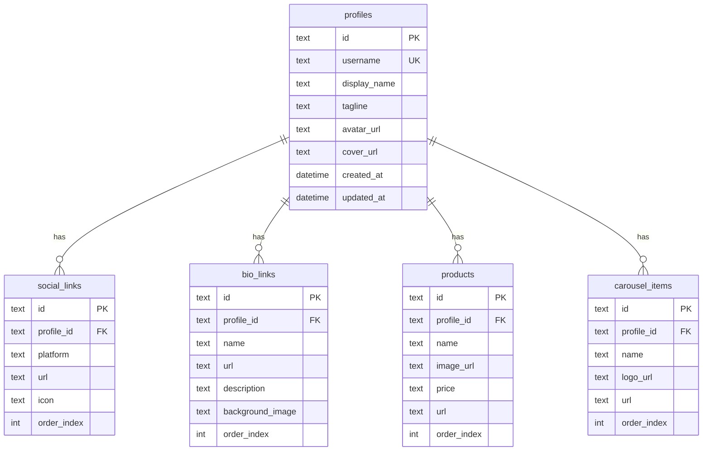

# Phase 02: Database Schema

## Context Links

- **Parent Plan**: [Migration Plan](./plan.md)
- **Previous**: [Phase 01: Environment Setup](./phase-01-environment-setup.md)
- **Next**: [Phase 03: KV Namespaces](./phase-03-kv-namespaces.md)
- **Research**: [Data Services](./research/researcher-02-data-services.md)

## Overview

Create D1 database, design schema matching current Edge Config structure, create migration scripts, add indexes for performance.

**Priority**: P0 (blocks API routes migration)
**Status**: pending
**Effort**: 3 hours
**Date**: 2026-01-18

## Key Insights

- D1 is SQLite-based, 10GB limit supports millions of profiles
- Current data structure: profile + socialLinks + links (bio) + products + aiTools
- Schema must support domain-based multi-tenancy via profile_id
- Indexes critical for username lookup, profile queries
- Foreign keys enforce referential integrity
- created_at/updated_at for audit trail

## Requirements

### Functional
- D1 database named `premium-bio-db`
- Schema matching current BioData TypeScript types
- Tables: profiles, social_links, bio_links, products, carousel_items
- Indexes on username, profile_id foreign keys
- Migration script for schema creation
- Local D1 instance for development

### Non-Functional
- Query performance <50ms for profile fetch
- Support for 10k+ profiles per database
- Atomic transactions for multi-table updates
- UTF-8 support for international characters

## Architecture



## Related Code Files

### To Create
- `/migrations/0001_initial_schema.sql` - Schema creation
- `/migrations/0002_seed_default_profile.sql` - Default data
- `/src/lib/db/schema.ts` - TypeScript schema definitions
- `/src/lib/db/types.ts` - D1 query result types

### To Modify
- `/wrangler.toml` - Add D1 binding
- `/src/lib/types.ts` - Add D1 row types (keep existing BioData types)

### To Delete
- None

## Implementation Steps

1. **Create D1 Database**
   ```bash
   wrangler d1 create premium-bio-db
   # Copy database_id from output
   ```

2. **Add D1 Binding to wrangler.toml**
   ```toml
   [[d1_databases]]
   binding = "DB"
   database_name = "premium-bio-db"
   database_id = "<paste-database-id-here>"
   preview_database_id = "<paste-database-id-here>"  # Same for dev
   ```

3. **Create Migration Directory**
   ```bash
   mkdir -p /Users/mbpprm/Documents/mybuild/for-free/premium-bio-website/migrations
   ```

4. **Create Schema Migration (0001_initial_schema.sql)**
   ```sql
   -- Profiles (core entity)
   CREATE TABLE profiles (
     id TEXT PRIMARY KEY,
     username TEXT UNIQUE NOT NULL,
     display_name TEXT NOT NULL,
     tagline TEXT,
     avatar_url TEXT,
     cover_url TEXT,
     created_at DATETIME DEFAULT CURRENT_TIMESTAMP,
     updated_at DATETIME DEFAULT CURRENT_TIMESTAMP
   );

   -- Social Links
   CREATE TABLE social_links (
     id TEXT PRIMARY KEY,
     profile_id TEXT NOT NULL,
     platform TEXT NOT NULL,
     url TEXT NOT NULL,
     icon TEXT,
     order_index INTEGER DEFAULT 0,
     FOREIGN KEY (profile_id) REFERENCES profiles(id) ON DELETE CASCADE
   );

   -- Bio Links
   CREATE TABLE bio_links (
     id TEXT PRIMARY KEY,
     profile_id TEXT NOT NULL,
     name TEXT NOT NULL,
     url TEXT NOT NULL,
     description TEXT,
     background_image TEXT,
     order_index INTEGER DEFAULT 0,
     FOREIGN KEY (profile_id) REFERENCES profiles(id) ON DELETE CASCADE
   );

   -- Products
   CREATE TABLE products (
     id TEXT PRIMARY KEY,
     profile_id TEXT NOT NULL,
     name TEXT NOT NULL,
     image_url TEXT,
     price TEXT NOT NULL,
     url TEXT NOT NULL,
     order_index INTEGER DEFAULT 0,
     FOREIGN KEY (profile_id) REFERENCES profiles(id) ON DELETE CASCADE
   );

   -- Carousel Items (AI Tools)
   CREATE TABLE carousel_items (
     id TEXT PRIMARY KEY,
     profile_id TEXT NOT NULL,
     name TEXT NOT NULL,
     logo_url TEXT,
     url TEXT NOT NULL,
     order_index INTEGER DEFAULT 0,
     FOREIGN KEY (profile_id) REFERENCES profiles(id) ON DELETE CASCADE
   );

   -- Indexes
   CREATE INDEX idx_profile_username ON profiles(username);
   CREATE INDEX idx_social_profile ON social_links(profile_id);
   CREATE INDEX idx_bio_links_profile ON bio_links(profile_id);
   CREATE INDEX idx_products_profile ON products(profile_id);
   CREATE INDEX idx_carousel_profile ON carousel_items(profile_id);
   ```

5. **Apply Migration to Remote D1**
   ```bash
   wrangler d1 execute premium-bio-db --remote --file=./migrations/0001_initial_schema.sql
   ```

6. **Apply Migration to Local D1**
   ```bash
   wrangler d1 execute premium-bio-db --local --file=./migrations/0001_initial_schema.sql
   ```

7. **Create Seed Migration (0002_seed_default_profile.sql)**
   ```sql
   -- Default profile for testing
   INSERT INTO profiles (id, username, display_name, tagline, avatar_url, cover_url)
   VALUES (
     'default-profile-id',
     'default',
     'Default Profile',
     'Premium Bio Website',
     'https://images.unsplash.com/photo-1535713875002-d1d0cf377fde',
     'https://images.unsplash.com/photo-1579546929518-9e396f3cc809'
   );
   ```

8. **Apply Seed Migration**
   ```bash
   wrangler d1 execute premium-bio-db --remote --file=./migrations/0002_seed_default_profile.sql
   wrangler d1 execute premium-bio-db --local --file=./migrations/0002_seed_default_profile.sql
   ```

9. **Create TypeScript Schema Definitions (src/lib/db/schema.ts)**
   ```typescript
   export interface ProfileRow {
     id: string;
     username: string;
     display_name: string;
     tagline: string | null;
     avatar_url: string | null;
     cover_url: string | null;
     created_at: string;
     updated_at: string;
   }

   export interface SocialLinkRow {
     id: string;
     profile_id: string;
     platform: string;
     url: string;
     icon: string | null;
     order_index: number;
   }

   export interface BioLinkRow {
     id: string;
     profile_id: string;
     name: string;
     url: string;
     description: string | null;
     background_image: string | null;
     order_index: number;
   }

   export interface ProductRow {
     id: string;
     profile_id: string;
     name: string;
     image_url: string | null;
     price: string;
     url: string;
     order_index: number;
   }

   export interface CarouselItemRow {
     id: string;
     profile_id: string;
     name: string;
     logo_url: string | null;
     url: string;
     order_index: number;
   }
   ```

10. **Verify Schema**
    ```bash
    # Query remote DB
    wrangler d1 execute premium-bio-db --remote --command="SELECT name FROM sqlite_master WHERE type='table'"

    # Query local DB
    wrangler d1 execute premium-bio-db --local --command="SELECT * FROM profiles"
    ```

## Todo List

- [ ] Create D1 database (wrangler d1 create premium-bio-db)
- [ ] Copy database_id and add to wrangler.toml
- [ ] Create migrations directory
- [ ] Write 0001_initial_schema.sql with all tables and indexes
- [ ] Apply schema migration to remote D1
- [ ] Apply schema migration to local D1
- [ ] Write 0002_seed_default_profile.sql
- [ ] Apply seed migration to remote and local
- [ ] Create src/lib/db/schema.ts with TypeScript interfaces
- [ ] Verify schema with wrangler d1 execute queries

## Success Criteria

- [ ] D1 database `premium-bio-db` created and visible in dashboard
- [ ] wrangler.toml has D1 binding with correct database_id
- [ ] All 5 tables created: profiles, social_links, bio_links, products, carousel_items
- [ ] All indexes created: idx_profile_username, idx_social_profile, etc.
- [ ] Foreign key constraints enforced (test with invalid profile_id)
- [ ] Seed data inserted: default profile exists
- [ ] TypeScript schema types defined in src/lib/db/schema.ts
- [ ] Remote and local D1 schemas match exactly

## Risk Assessment

| Risk | Impact | Mitigation |
|------|--------|-----------|
| D1 beta instability | High | Keep Edge Config as fallback during migration |
| Schema changes break API | High | Test all queries before Phase 05 |
| Migration rollback needed | Medium | Keep migration files versioned, document rollback steps |
| Index missing hurts performance | Medium | Benchmark queries, add indexes as needed |
| UTF-8 encoding issues | Low | Test with international characters in seed data |

## Security Considerations

- **No sensitive data in schema**: Passwords stored separately if needed
- **Foreign key cascade deletes**: Prevent orphaned records
- **SQL injection prevention**: Use prepared statements with .bind()
- **Row-level security**: Implement in API layer (Phase 05)

## Next Steps

1. Proceed to Phase 03: KV Namespaces after schema verified
2. Keep migration files for documentation
3. Test complex queries (joins, aggregations) before Phase 05

---

## Unresolved Questions

- Should profile IDs use username or UUID? (Recommend UUID for flexibility)
- Need admin_users table for authentication? (Discuss in Phase 06)
- How to handle schema versioning for future changes?
- Should we add soft deletes (deleted_at column)?
