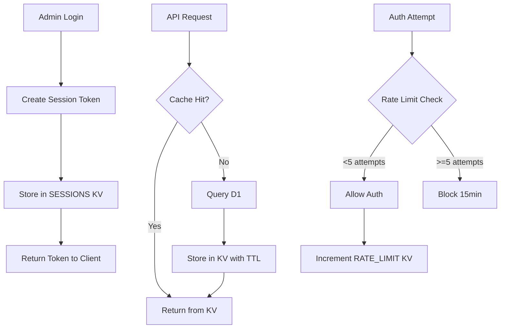

# Phase 03: KV Namespaces

## Context Links

- **Parent Plan**: [Migration Plan](./plan.md)
- **Previous**: [Phase 02: Database Schema](./phase-02-database-schema.md)
- **Next**: [Phase 04: R2 Bucket](./phase-04-r2-bucket.md)
- **Research**: [Data Services](./research/researcher-02-data-services.md)

## Overview

Create 3 KV namespaces for config cache, sessions, and rate limiting. Configure bindings in wrangler.toml for local and production environments.

**Priority**: P0 (blocks admin authentication and caching)
**Status**: pending
**Effort**: 1 hour
**Date**: 2026-01-18

## Key Insights

- KV provides eventual consistency, fast reads (<10ms globally)
- 3 namespaces separate concerns: cache, sessions, rate limits
- TTL (expirationTtl) auto-expires keys, no manual cleanup needed
- KV free tier: 100k reads/day, 1k writes/day, 1GB storage
- Config cache reduces D1 queries 10-100x with aggressive TTLs

## Requirements

### Functional
- KV namespace: `CONFIG_CACHE` - Profile data cache (TTL 1-24h)
- KV namespace: `SESSIONS` - Admin session tokens (TTL 24h)
- KV namespace: `RATE_LIMIT` - Auth attempt tracking (TTL 5-15min)
- Bindings in wrangler.toml for local and production
- Helper functions for cache invalidation

### Non-Functional
- Read latency <10ms for cached profiles
- Write latency <100ms acceptable for admin ops
- Eventual consistency acceptable for non-critical data
- Storage <100MB expected for 10k profiles

## Architecture



## Related Code Files

### To Create
- `/src/lib/kv/cache.ts` - Config cache helpers
- `/src/lib/kv/sessions.ts` - Session management
- `/src/lib/kv/rate-limit.ts` - Rate limiting logic

### To Modify
- `/wrangler.toml` - Add 3 KV namespace bindings
- `/src/lib/types.ts` - Add Env interface with KV bindings

### To Delete
- None

## Implementation Steps

1. **Create CONFIG_CACHE Namespace**
   ```bash
   wrangler kv:namespace create "CONFIG_CACHE"
   # Copy id from output
   ```

2. **Create SESSIONS Namespace**
   ```bash
   wrangler kv:namespace create "SESSIONS"
   # Copy id from output
   ```

3. **Create RATE_LIMIT Namespace**
   ```bash
   wrangler kv:namespace create "RATE_LIMIT"
   # Copy id from output
   ```

4. **Add KV Bindings to wrangler.toml**
   ```toml
   # Production bindings
   [[kv_namespaces]]
   binding = "CONFIG_CACHE"
   id = "<config-cache-id>"

   [[kv_namespaces]]
   binding = "SESSIONS"
   id = "<sessions-id>"

   [[kv_namespaces]]
   binding = "RATE_LIMIT"
   id = "<rate-limit-id>"

   # Preview bindings (for local dev)
   [[kv_namespaces]]
   binding = "CONFIG_CACHE"
   id = "<config-cache-id>"
   preview_id = "<config-cache-id>"

   [[kv_namespaces]]
   binding = "SESSIONS"
   id = "<sessions-id>"
   preview_id = "<sessions-id>"

   [[kv_namespaces]]
   binding = "RATE_LIMIT"
   id = "<rate-limit-id>"
   preview_id = "<rate-limit-id>"
   ```

5. **Create Cache Helper (src/lib/kv/cache.ts)**
   ```typescript
   import { BioData } from '@/lib/types';

   export class ConfigCache {
     constructor(private kv: KVNamespace) {}

     async get(username: string): Promise<BioData | null> {
       const key = `profile:${username}`;
       return await this.kv.get<BioData>(key, 'json');
     }

     async set(username: string, data: BioData, ttlSeconds = 3600): Promise<void> {
       const key = `profile:${username}`;
       await this.kv.put(key, JSON.stringify(data), {
         expirationTtl: ttlSeconds
       });
     }

     async invalidate(username: string): Promise<void> {
       const key = `profile:${username}`;
       await this.kv.delete(key);
     }

     async invalidateAll(): Promise<void> {
       // KV doesn't support bulk delete, need to track keys
       // Alternative: Let TTL expire naturally
       console.warn('Cache invalidation relies on TTL expiry');
     }
   }
   ```

6. **Create Session Helper (src/lib/kv/sessions.ts)**
   ```typescript
   import { randomUUID } from 'crypto';

   export interface SessionData {
     username: string;
     admin: boolean;
     createdAt: string;
   }

   export class SessionManager {
     constructor(private kv: KVNamespace) {}

     async create(username: string, ttlSeconds = 86400): Promise<string> {
       const token = randomUUID();
       const sessionData: SessionData = {
         username,
         admin: true,
         createdAt: new Date().toISOString()
       };

       await this.kv.put(`session:${token}`, JSON.stringify(sessionData), {
         expirationTtl: ttlSeconds
       });

       return token;
     }

     async verify(token: string): Promise<SessionData | null> {
       const data = await this.kv.get<SessionData>(`session:${token}`, 'json');
       return data;
     }

     async destroy(token: string): Promise<void> {
       await this.kv.delete(`session:${token}`);
     }
   }
   ```

7. **Create Rate Limit Helper (src/lib/kv/rate-limit.ts)**
   ```typescript
   export class RateLimiter {
     constructor(private kv: KVNamespace) {}

     async checkAndIncrement(identifier: string, maxAttempts = 5): Promise<{
       allowed: boolean;
       attempts: number;
       resetAt?: Date;
     }> {
       const key = `auth_attempt:${identifier}`;
       const current = await this.kv.get(key);
       const attempts = current ? parseInt(current) : 0;

       if (attempts >= maxAttempts) {
         return {
           allowed: false,
           attempts,
           resetAt: new Date(Date.now() + 15 * 60 * 1000) // 15 min
         };
       }

       await this.kv.put(key, String(attempts + 1), {
         expirationTtl: 300 // 5 minutes
       });

       return { allowed: true, attempts: attempts + 1 };
     }

     async reset(identifier: string): Promise<void> {
       const key = `auth_attempt:${identifier}`;
       await this.kv.delete(key);
     }
   }
   ```

8. **Update Env Interface (src/lib/types.ts)**
   ```typescript
   // Add to existing types.ts
   export interface Env {
     DB: D1Database;
     CONFIG_CACHE: KVNamespace;
     SESSIONS: KVNamespace;
     RATE_LIMIT: KVNamespace;
     ADMIN_SECRET: string;
     DOMAIN: string;
   }
   ```

9. **Test KV Operations**
   ```bash
   # Test write
   wrangler kv:key put --binding=CONFIG_CACHE "test:key" "test-value"

   # Test read
   wrangler kv:key get --binding=CONFIG_CACHE "test:key"

   # Test delete
   wrangler kv:key delete --binding=CONFIG_CACHE "test:key"

   # List keys (first 10)
   wrangler kv:key list --binding=CONFIG_CACHE
   ```

10. **Verify Bindings in Local Dev**
    ```bash
    npx wrangler pages dev ./out
    # Check console for KV namespace bindings loaded
    ```

## Todo List

- [ ] Create CONFIG_CACHE namespace (wrangler kv:namespace create)
- [ ] Create SESSIONS namespace
- [ ] Create RATE_LIMIT namespace
- [ ] Copy all 3 namespace IDs
- [ ] Add 3 KV bindings to wrangler.toml (production + preview)
- [ ] Create src/lib/kv/cache.ts with ConfigCache class
- [ ] Create src/lib/kv/sessions.ts with SessionManager class
- [ ] Create src/lib/kv/rate-limit.ts with RateLimiter class
- [ ] Update src/lib/types.ts with Env interface
- [ ] Test KV operations (put/get/delete) via wrangler CLI

## Success Criteria

- [ ] 3 KV namespaces visible in Cloudflare dashboard
- [ ] wrangler.toml has 3 KV bindings with correct IDs
- [ ] ConfigCache, SessionManager, RateLimiter classes implemented
- [ ] Env interface includes all 3 KV namespace types
- [ ] Test key-value operations succeed via CLI
- [ ] Local dev server loads KV bindings without errors

## Risk Assessment

| Risk | Impact | Mitigation |
|------|--------|-----------|
| Eventual consistency issues | Medium | Use D1 for critical reads, KV for cache only |
| KV quota exceeded (1k writes/day) | Low | Free tier sufficient for bio app traffic |
| Key naming collisions | Low | Use prefixes (profile:, session:, auth_attempt:) |
| TTL misconfiguration | Medium | Test expiry with short TTLs first |

## Security Considerations

- **Session tokens**: Use crypto.randomUUID() for unpredictability
- **Rate limiting**: 5 attempts per 5min prevents brute force
- **No encryption**: KV values plain text, don't store passwords
- **Key prefixes**: Prevent namespace collisions (profile:, session:)

## Next Steps

1. Proceed to Phase 04: R2 Bucket after KV verified
2. Keep KV helper classes for use in Phase 05 (API routes)
3. Monitor KV usage in dashboard during testing

---

## Unresolved Questions

- Should session TTL be configurable (24h default)?
- Need separate rate limit thresholds for different endpoints?
- How to handle KV namespace migration if we rename bindings?
- Should we implement KV bulk delete for cache invalidation?
