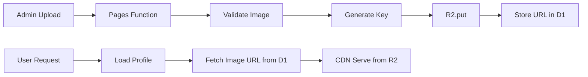

# Phase 04: R2 Bucket

## Context Links

- **Parent Plan**: [Migration Plan](./plan.md)
- **Previous**: [Phase 03: KV Namespaces](./phase-03-kv-namespaces.md)
- **Next**: [Phase 05: API Routes Migration](./phase-05-api-routes-migration.md)
- **Research**: [Data Services](./research/researcher-02-data-services.md)

## Overview

Create R2 bucket for media storage (avatars, covers, product images, carousel items). Configure public access, add binding to wrangler.toml.

**Priority**: P1 (optional for initial migration, required for media uploads)
**Status**: pending
**Effort**: 1 hour
**Date**: 2026-01-18

## Key Insights

- R2 is S3-compatible object storage, zero egress fees within Cloudflare
- Free tier: 10GB storage, 1M Class A ops/month (writes), 10M Class B ops/month (reads)
- Public bucket + custom domain = CDN for images
- Current app uses external URLs (Unsplash, Cloudinary) - R2 optional for now
- Folder structure: profiles/{id}/avatar, products/{id}/image

## Requirements

### Functional
- R2 bucket: `bio-media`
- Public read access for profile images
- Folder structure: profiles/, products/, carousel/, tmp/
- Binding in wrangler.toml
- Custom domain for CDN access (optional)

### Non-Functional
- Upload speed <500ms for images <5MB
- Storage <5GB expected for 10k profiles
- Image formats: JPEG, PNG, WebP, GIF
- Max file size: 10MB per image

## Architecture



**Folder Structure:**
```
bio-media/
├── profiles/
│   ├── {profile-id}/
│   │   ├── avatar.jpg
│   │   └── cover.jpg
├── products/
│   └── {product-id}/
│       └── image.jpg
├── carousel/
│   └── {item-id}/
│       └── logo.png
└── tmp/
    └── {upload-id}/
        └── pending.jpg
```

## Related Code Files

### To Create
- `/src/lib/r2/storage.ts` - R2 upload/delete helpers
- `/src/lib/r2/types.ts` - R2 metadata types

### To Modify
- `/wrangler.toml` - Add R2 bucket binding
- `/src/lib/types.ts` - Add R2Bucket to Env interface

### To Delete
- None

## Implementation Steps

1. **Create R2 Bucket**
   ```bash
   wrangler r2 bucket create bio-media
   # Note: Bucket name must be globally unique
   ```

2. **Add R2 Binding to wrangler.toml**
   ```toml
   [[r2_buckets]]
   binding = "MEDIA"
   bucket_name = "bio-media"
   preview_bucket_name = "bio-media"  # Same for local dev
   ```

3. **Configure Public Access (Optional for Phase 1)**
   ```bash
   # Via dashboard: R2 > bio-media > Settings > Public Access
   # Enable "Allow Public Access" for read-only
   # Custom domain: media.yourdomain.com → bio-media bucket
   ```

4. **Create Storage Helper (src/lib/r2/storage.ts)**
   ```typescript
   export class MediaStorage {
     constructor(private bucket: R2Bucket) {}

     async uploadProfileAvatar(
       profileId: string,
       file: ArrayBuffer,
       contentType: string
     ): Promise<string> {
       const key = `profiles/${profileId}/avatar.${this.getExtension(contentType)}`;
       await this.bucket.put(key, file, {
         httpMetadata: { contentType }
       });
       return this.getPublicUrl(key);
     }

     async uploadProfileCover(
       profileId: string,
       file: ArrayBuffer,
       contentType: string
     ): Promise<string> {
       const key = `profiles/${profileId}/cover.${this.getExtension(contentType)}`;
       await this.bucket.put(key, file, {
         httpMetadata: { contentType }
       });
       return this.getPublicUrl(key);
     }

     async uploadProductImage(
       productId: string,
       file: ArrayBuffer,
       contentType: string
     ): Promise<string> {
       const key = `products/${productId}/image.${this.getExtension(contentType)}`;
       await this.bucket.put(key, file, {
         httpMetadata: { contentType }
       });
       return this.getPublicUrl(key);
     }

     async delete(key: string): Promise<void> {
       await this.bucket.delete(key);
     }

     async get(key: string): Promise<R2ObjectBody | null> {
       return await this.bucket.get(key);
     }

     private getExtension(contentType: string): string {
       const map: Record<string, string> = {
         'image/jpeg': 'jpg',
         'image/png': 'png',
         'image/webp': 'webp',
         'image/gif': 'gif'
       };
       return map[contentType] || 'jpg';
     }

     private getPublicUrl(key: string): string {
       // Option 1: R2.dev public URL (auto-generated)
       // return `https://bio-media.r2.cloudflarestorage.com/${key}`;

       // Option 2: Custom domain (if configured)
       const domain = process.env.R2_PUBLIC_DOMAIN || 'media.yourdomain.com';
       return `https://${domain}/${key}`;
     }
   }
   ```

5. **Create R2 Types (src/lib/r2/types.ts)**
   ```typescript
   export interface UploadResult {
     key: string;
     url: string;
     size: number;
     contentType: string;
   }

   export interface ImageMetadata {
     width?: number;
     height?: number;
     format?: string;
   }
   ```

6. **Update Env Interface (src/lib/types.ts)**
   ```typescript
   export interface Env {
     DB: D1Database;
     CONFIG_CACHE: KVNamespace;
     SESSIONS: KVNamespace;
     RATE_LIMIT: KVNamespace;
     MEDIA: R2Bucket;  // Add this
     ADMIN_SECRET: string;
     DOMAIN: string;
     R2_PUBLIC_DOMAIN?: string;
   }
   ```

7. **Test R2 Operations**
   ```bash
   # Upload test file
   echo "test content" > test.txt
   wrangler r2 object put bio-media/test.txt --file=test.txt

   # List objects
   wrangler r2 object list bio-media

   # Download object
   wrangler r2 object get bio-media/test.txt --file=downloaded.txt

   # Delete object
   wrangler r2 object delete bio-media/test.txt

   # Clean up
   rm test.txt downloaded.txt
   ```

8. **Add .dev.vars Entry (Optional)**
   ```env
   R2_PUBLIC_DOMAIN=localhost:8788
   ```

9. **Verify Binding in Local Dev**
   ```bash
   npx wrangler pages dev ./out
   # Check console for R2 bucket binding loaded
   ```

10. **Document Public URL Pattern**
    ```
    Current external URLs (keep for Phase 1):
    - Unsplash: https://images.unsplash.com/...
    - Cloudinary: https://res.cloudinary.com/...

    Future R2 URLs (Phase 2 - media uploads):
    - Custom domain: https://media.yourdomain.com/profiles/{id}/avatar.jpg
    - R2.dev fallback: https://bio-media.r2.cloudflarestorage.com/...
    ```

## Todo List

- [ ] Create R2 bucket (wrangler r2 bucket create bio-media)
- [ ] Add R2 binding to wrangler.toml
- [ ] Create src/lib/r2/storage.ts with MediaStorage class
- [ ] Create src/lib/r2/types.ts with upload types
- [ ] Update src/lib/types.ts Env interface with MEDIA: R2Bucket
- [ ] Test R2 operations via CLI (put/get/list/delete)
- [ ] Verify R2 binding in local dev server
- [ ] Document public URL pattern for future media uploads
- [ ] (Optional) Configure custom domain for R2 public access

## Success Criteria

- [ ] R2 bucket `bio-media` created and visible in dashboard
- [ ] wrangler.toml has R2 bucket binding
- [ ] MediaStorage class implemented with upload helpers
- [ ] Env interface includes R2Bucket type
- [ ] Test file upload/download via CLI succeeds
- [ ] Local dev server loads R2 binding without errors
- [ ] Public URL pattern documented

## Risk Assessment

| Risk | Impact | Mitigation |
|------|--------|-----------|
| Public bucket misconfiguration | High | Test with non-sensitive images first |
| Storage quota exceeded (10GB) | Low | Monitor usage, implement cleanup policy |
| Upload validation missing | Medium | Add file type/size checks in Phase 05 |
| CDN cache invalidation | Low | Use versioned keys (avatar-v2.jpg) |

## Security Considerations

- **Public read, private write**: Only Pages Functions can upload
- **File validation**: Check MIME type, max size before upload
- **Path traversal**: Sanitize profile_id, product_id in keys
- **Signed URLs**: For private content (future feature)

## Next Steps

1. Proceed to Phase 05: API Routes Migration
2. R2 bucket ready but unused until media upload feature
3. Keep MediaStorage class for future admin panel integration

---

## Unresolved Questions

- Should we implement image optimization (resize, WebP conversion) before R2 upload?
- Need CORS configuration for direct browser uploads?
- How to handle image migration from Unsplash/Cloudinary to R2?
- Should we add R2 lifecycle policies for tmp/ folder cleanup?
