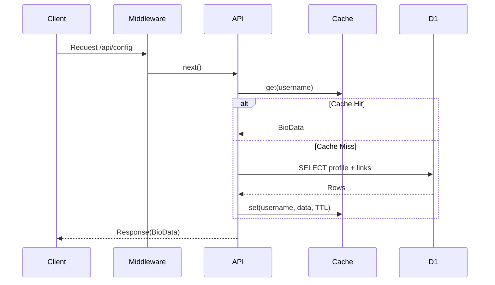

# Phase 05: API Routes Migration

## Context Links

- **Parent Plan**: [Migration Plan](./plan.md)
- **Previous**: [Phase 04: R2 Bucket](./phase-04-r2-bucket.md)
- **Next**: [Phase 06: Admin Panel Updates](./phase-06-admin-panel-updates.md)
- **Research**: [Pages Deployment](./research/researcher-01-pages-deployment.md)

## Overview

Migrate 4 API routes from Next.js App Router to Cloudflare Pages Functions. Convert Edge Config reads/writes to D1 + KV operations.

**Priority**: P0 (core functionality)
**Status**: pending
**Effort**: 6 hours
**Date**: 2026-01-18

## Key Insights

- Next.js App Router: `app/api/*/route.ts` → Pages Functions: `functions/api/*.ts`
- Replace `@vercel/edge-config` with D1 queries + KV cache
- Pages Functions export: `onRequestGet`, `onRequestPost`, etc.
- Middleware pattern: `functions/_middleware.ts` for auth/CORS
- Context object provides: `env`, `request`, `params`, `next()`

## Requirements

### Functional
- Migrate GET /api/config → fetch profile from D1 with KV cache
- Migrate POST /api/admin/update → update D1 + invalidate cache
- Migrate POST /api/admin/import → bulk insert D1 from JSON
- Migrate GET /api/admin/export → export D1 data to JSON
- Implement middleware for admin auth + CORS

### Non-Functional
- Response time <100ms for cached config reads
- Atomic transactions for multi-table updates
- Backward compatible response format (BioData type)
- Error handling with proper HTTP status codes

## Architecture



## Related Code Files

### To Create
- `/functions/_middleware.ts` - Auth + CORS middleware
- `/functions/api/config.ts` - GET config (replaces route.ts)
- `/functions/api/admin/update.ts` - POST update (replaces route.ts)
- `/functions/api/admin/import.ts` - POST import (replaces route.ts)
- `/functions/api/admin/export.ts` - GET export (replaces route.ts)
- `/src/lib/db/queries.ts` - D1 query helpers

### To Modify
- None (Pages Functions are separate from Next.js routes)

### To Delete (after testing)
- `/src/app/api/config/route.ts`
- `/src/app/api/admin/update/route.ts`
- `/src/app/api/admin/import/route.ts`
- `/src/app/api/admin/export/route.ts`

## Implementation Steps

### 1. Create Query Helpers (src/lib/db/queries.ts)

```typescript
import { Env } from '@/lib/types';
import { BioData, Profile, Link, Product, AITool, SocialLink } from '@/lib/types';
import { ConfigCache } from '@/lib/kv/cache';

export class BioDataQueries {
  private cache: ConfigCache;

  constructor(private env: Env) {
    this.cache = new ConfigCache(env.CONFIG_CACHE);
  }

  async getByUsername(username: string): Promise<BioData | null> {
    // Try cache first
    const cached = await this.cache.get(username);
    if (cached) return cached;

    // Query D1
    const domain = this.env.DOMAIN || 'default';
    const profile = await this.env.DB.prepare(`
      SELECT * FROM profiles WHERE username = ?
    `).bind(domain).first();

    if (!profile) return null;

    // Fetch related data
    const [socialLinks, links, products, aiTools] = await Promise.all([
      this.getSocialLinks(profile.id),
      getBioLinks(profile.id),
      this.getProducts(profile.id),
      this.getCarouselItems(profile.id)
    ]);

    // Transform to BioData format
    const bioData: BioData = {
      profile: {
        name: profile.display_name,
        tagline: profile.tagline || '',
        avatar: profile.avatar_url || '',
        coverImage: profile.cover_url || '',
        socialLinks: socialLinks.map(sl => ({
          name: sl.platform,
          url: sl.url,
          icon: sl.icon || ''
        }))
      },
      links: links.map((l, i) => ({
        id: i + 1,
        name: l.name,
        url: l.url,
        description: l.description || '',
        backgroundImage: l.background_image || ''
      })),
      products: products.map((p, i) => ({
        id: i + 1,
        name: p.name,
        image: p.image_url || '',
        price: p.price,
        url: p.url
      })),
      aiTools: aiTools.map((t, i) => ({
        id: i + 1,
        name: t.name,
        logo: t.logo_url || '',
        url: t.url
      }))
    };

    // Cache for 1 hour
    await this.cache.set(username, bioData, 3600);
    return bioData;
  }

  private async getSocialLinks(profileId: string) {
    const { results } = await this.env.DB.prepare(`
      SELECT * FROM social_links WHERE profile_id = ? ORDER BY order_index
    `).bind(profileId).all();
    return results || [];
  }

  private async getBioLinks(profileId: string) {
    const { results } = await this.env.DB.prepare(`
      SELECT * FROM bio_links WHERE profile_id = ? ORDER BY order_index
    `).bind(profileId).all();
    return results || [];
  }

  private async getProducts(profileId: string) {
    const { results } = await this.env.DB.prepare(`
      SELECT * FROM products WHERE profile_id = ? ORDER BY order_index
    `).bind(profileId).all();
    return results || [];
  }

  private async getCarouselItems(profileId: string) {
    const { results } = await this.env.DB.prepare(`
      SELECT * FROM carousel_items WHERE profile_id = ? ORDER BY order_index
    `).bind(profileId).all();
    return results || [];
  }

  async updateProfile(username: string, bioData: BioData): Promise<void> {
    const domain = this.env.DOMAIN || 'default';

    // Get profile ID
    let profile = await this.env.DB.prepare(`
      SELECT id FROM profiles WHERE username = ?
    `).bind(domain).first<{ id: string }>();

    // Create profile if doesn't exist
    if (!profile) {
      const profileId = crypto.randomUUID();
      await this.env.DB.prepare(`
        INSERT INTO profiles (id, username, display_name, tagline, avatar_url, cover_url)
        VALUES (?, ?, ?, ?, ?, ?)
      `).bind(
        profileId,
        domain,
        bioData.profile.name,
        bioData.profile.tagline,
        bioData.profile.avatar,
        bioData.profile.coverImage
      ).run();
      profile = { id: profileId };
    } else {
      // Update existing profile
      await this.env.DB.prepare(`
        UPDATE profiles
        SET display_name = ?, tagline = ?, avatar_url = ?, cover_url = ?, updated_at = CURRENT_TIMESTAMP
        WHERE id = ?
      `).bind(
        bioData.profile.name,
        bioData.profile.tagline,
        bioData.profile.avatar,
        bioData.profile.coverImage,
        profile.id
      ).run();
    }

    // Delete existing related data
    await Promise.all([
      this.env.DB.prepare(`DELETE FROM social_links WHERE profile_id = ?`).bind(profile.id).run(),
      this.env.DB.prepare(`DELETE FROM bio_links WHERE profile_id = ?`).bind(profile.id).run(),
      this.env.DB.prepare(`DELETE FROM products WHERE profile_id = ?`).bind(profile.id).run(),
      this.env.DB.prepare(`DELETE FROM carousel_items WHERE profile_id = ?`).bind(profile.id).run()
    ]);

    // Insert new data using batch
    const statements = [];

    // Social links
    bioData.profile.socialLinks.forEach((sl, i) => {
      statements.push(
        this.env.DB.prepare(`
          INSERT INTO social_links (id, profile_id, platform, url, icon, order_index)
          VALUES (?, ?, ?, ?, ?, ?)
        `).bind(crypto.randomUUID(), profile.id, sl.name, sl.url, sl.icon, i)
      );
    });

    // Bio links
    bioData.links.forEach((l, i) => {
      statements.push(
        this.env.DB.prepare(`
          INSERT INTO bio_links (id, profile_id, name, url, description, background_image, order_index)
          VALUES (?, ?, ?, ?, ?, ?, ?)
        `).bind(crypto.randomUUID(), profile.id, l.name, l.url, l.description, l.backgroundImage, i)
      );
    });

    // Products
    bioData.products.forEach((p, i) => {
      statements.push(
        this.env.DB.prepare(`
          INSERT INTO products (id, profile_id, name, image_url, price, url, order_index)
          VALUES (?, ?, ?, ?, ?, ?, ?)
        `).bind(crypto.randomUUID(), profile.id, p.name, p.image, p.price, p.url, i)
      );
    });

    // AI Tools
    bioData.aiTools.forEach((t, i) => {
      statements.push(
        this.env.DB.prepare(`
          INSERT INTO carousel_items (id, profile_id, name, logo_url, url, order_index)
          VALUES (?, ?, ?, ?, ?, ?)
        `).bind(crypto.randomUUID(), profile.id, t.name, t.logo, t.url, i)
      );
    });

    // Execute batch atomically
    await this.env.DB.batch(statements);

    // Invalidate cache
    await this.cache.invalidate(username);
  }
}
```

### 2. Create Middleware (functions/_middleware.ts)

```typescript
import { Env } from '@/lib/types';

export const onRequest: PagesFunction<Env>[] = [
  async (context) => {
    const { request, env, next } = context;
    const url = new URL(request.url);

    // CORS headers
    const corsHeaders = {
      'Access-Control-Allow-Origin': '*',
      'Access-Control-Allow-Methods': 'GET, POST, OPTIONS',
      'Access-Control-Allow-Headers': 'Content-Type, x-admin-secret',
    };

    // Handle preflight
    if (request.method === 'OPTIONS') {
      return new Response(null, { headers: corsHeaders });
    }

    // Admin auth for /admin/* routes
    if (url.pathname.includes('/admin/')) {
      const adminSecret = request.headers.get('x-admin-secret');
      if (!adminSecret || adminSecret !== env.ADMIN_SECRET) {
        return new Response(JSON.stringify({ error: 'Unauthorized' }), {
          status: 401,
          headers: { ...corsHeaders, 'Content-Type': 'application/json' }
        });
      }
    }

    // Continue to route handler
    const response = await next();

    // Add CORS to response
    Object.entries(corsHeaders).forEach(([key, value]) => {
      response.headers.set(key, value);
    });

    return response;
  }
];
```

### 3. Create GET /api/config (functions/api/config.ts)

```typescript
import { Env } from '@/lib/types';
import { BioDataQueries } from '@/lib/db/queries';

export const onRequestGet: PagesFunction<Env> = async ({ env }) => {
  try {
    const queries = new BioDataQueries(env);
    const domain = env.DOMAIN || 'default';
    const bioData = await queries.getByUsername(domain);

    if (!bioData) {
      // Fallback to default data if no profile found
      const fallbackData = {
        profile: {
          name: 'Default Profile',
          tagline: 'Premium Bio Website',
          avatar: 'https://images.unsplash.com/photo-1535713875002-d1d0cf377fde',
          coverImage: 'https://images.unsplash.com/photo-1579546929518-9e396f3cc809',
          socialLinks: []
        },
        links: [],
        products: [],
        aiTools: []
      };
      return Response.json(fallbackData);
    }

    return Response.json(bioData);
  } catch (error) {
    console.error('Error fetching config:', error);
    return Response.json(
      { error: 'Internal server error' },
      { status: 500 }
    );
  }
};
```

### 4. Create POST /api/admin/update (functions/api/admin/update.ts)

```typescript
import { Env } from '@/lib/types';
import { BioDataQueries } from '@/lib/db/queries';
import { bioDataSchema } from '@/lib/types';

export const onRequestPost: PagesFunction<Env> = async ({ request, env }) => {
  try {
    const body = await request.json();

    // Validate with Zod
    const validatedData = bioDataSchema.parse(body.bioData);

    // Update database
    const queries = new BioDataQueries(env);
    const domain = env.DOMAIN || 'default';
    await queries.updateProfile(domain, validatedData);

    return Response.json({
      success: true,
      message: 'Configuration updated successfully'
    });
  } catch (error) {
    console.error('Update error:', error);
    return Response.json(
      { error: 'Failed to update configuration', details: error.message },
      { status: 400 }
    );
  }
};
```

### 5. Create POST /api/admin/import (functions/api/admin/import.ts)

```typescript
import { Env } from '@/lib/types';
import { BioDataQueries } from '@/lib/db/queries';
import { bioDataSchema } from '@/lib/types';

export const onRequestPost: PagesFunction<Env> = async ({ request, env }) => {
  try {
    const body = await request.json();

    if (!body.bioData) {
      return Response.json(
        { error: 'Bio data is required for import' },
        { status: 400 }
      );
    }

    // Validate with Zod
    const validatedData = bioDataSchema.parse(body.bioData);

    // Import to database (same as update)
    const queries = new BioDataQueries(env);
    const domain = env.DOMAIN || 'default';
    await queries.updateProfile(domain, validatedData);

    return Response.json({
      success: true,
      message: 'Bio data imported successfully'
    });
  } catch (error) {
    console.error('Import error:', error);
    return Response.json(
      { error: 'Failed to import configuration', details: error.message },
      { status: 400 }
    );
  }
};
```

### 6. Create GET /api/admin/export (functions/api/admin/export.ts)

```typescript
import { Env } from '@/lib/types';
import { BioDataQueries } from '@/lib/db/queries';

export const onRequestGet: PagesFunction<Env> = async ({ env }) => {
  try {
    const queries = new BioDataQueries(env);
    const domain = env.DOMAIN || 'default';
    const bioData = await queries.getByUsername(domain);

    if (!bioData) {
      return Response.json(
        { error: 'No data found to export' },
        { status: 404 }
      );
    }

    return Response.json({
      success: true,
      bioData,
      exportedAt: new Date().toISOString()
    });
  } catch (error) {
    console.error('Export error:', error);
    return Response.json(
      { error: 'Failed to export configuration' },
      { status: 500 }
    );
  }
};
```

### 7. Test Local Development

```bash
npm run build
npx wrangler pages dev ./out --binding DB=... --kv CONFIG_CACHE=...

# Test GET /api/config
curl http://localhost:8788/api/config

# Test POST /api/admin/update
curl -X POST http://localhost:8788/api/admin/update \
  -H "Content-Type: application/json" \
  -H "x-admin-secret: your_secret" \
  -d '{"bioData": {...}}'
```

### 8. Create Types for Pages Functions

```typescript
// Add to src/lib/types.ts
import { D1Database, KVNamespace, R2Bucket } from '@cloudflare/workers-types';

export interface Env {
  DB: D1Database;
  CONFIG_CACHE: KVNamespace;
  SESSIONS: KVNamespace;
  RATE_LIMIT: KVNamespace;
  MEDIA: R2Bucket;
  ADMIN_SECRET: string;
  DOMAIN: string;
  R2_PUBLIC_DOMAIN?: string;
}

declare global {
  interface PagesFunction<Env = unknown> {
    (context: EventContext<Env, any, Record<string, unknown>>): Response | Promise<Response>;
  }
}
```

## Todo List

- [ ] Create src/lib/db/queries.ts with BioDataQueries class
- [ ] Implement getByUsername with D1 + KV cache
- [ ] Implement updateProfile with atomic batch operations
- [ ] Create functions/_middleware.ts with auth + CORS
- [ ] Create functions/api/config.ts (GET handler)
- [ ] Create functions/api/admin/update.ts (POST handler)
- [ ] Create functions/api/admin/import.ts (POST handler)
- [ ] Create functions/api/admin/export.ts (GET handler)
- [ ] Update src/lib/types.ts with Env and PagesFunction types
- [ ] Test all 4 endpoints locally with wrangler pages dev
- [ ] Verify cache hit/miss behavior
- [ ] Test admin auth with correct/incorrect secrets

## Success Criteria

- [ ] All 4 API routes functional as Pages Functions
- [ ] GET /api/config returns BioData from D1 + cache
- [ ] POST /api/admin/update persists to D1, invalidates cache
- [ ] POST /api/admin/import bulk inserts data
- [ ] GET /api/admin/export returns current D1 data
- [ ] Middleware blocks unauthorized admin requests
- [ ] CORS headers present on all responses
- [ ] Cache hit reduces response time to <50ms
- [ ] Local testing passes for all endpoints

## Risk Assessment

| Risk | Impact | Mitigation |
|------|--------|-----------|
| D1 query errors break API | High | Extensive testing, error handling, fallback data |
| Cache invalidation timing | Medium | Aggressive TTL (1h), manual invalidation on updates |
| Batch operations fail partially | High | Use D1.batch() for atomicity |
| TypeScript type mismatches | Medium | Strict type checking, runtime validation with Zod |

## Security Considerations

- **Admin secret validation**: Middleware checks x-admin-secret header
- **SQL injection prevention**: Use prepared statements with .bind()
- **Input validation**: Zod schema validation before database operations
- **Rate limiting**: Implement in Phase 06 for admin endpoints

## Next Steps

1. Proceed to Phase 06: Admin Panel Updates
2. Keep old Next.js routes until Phase 09 testing complete
3. Monitor D1 query performance in dashboard

---

## Unresolved Questions

- Should we implement request logging for debugging?
- Need separate error tracking (Sentry, Cloudflare Workers Analytics)?
- How to handle API versioning if schema changes?
- Should we add ETag headers for config endpoint caching?
