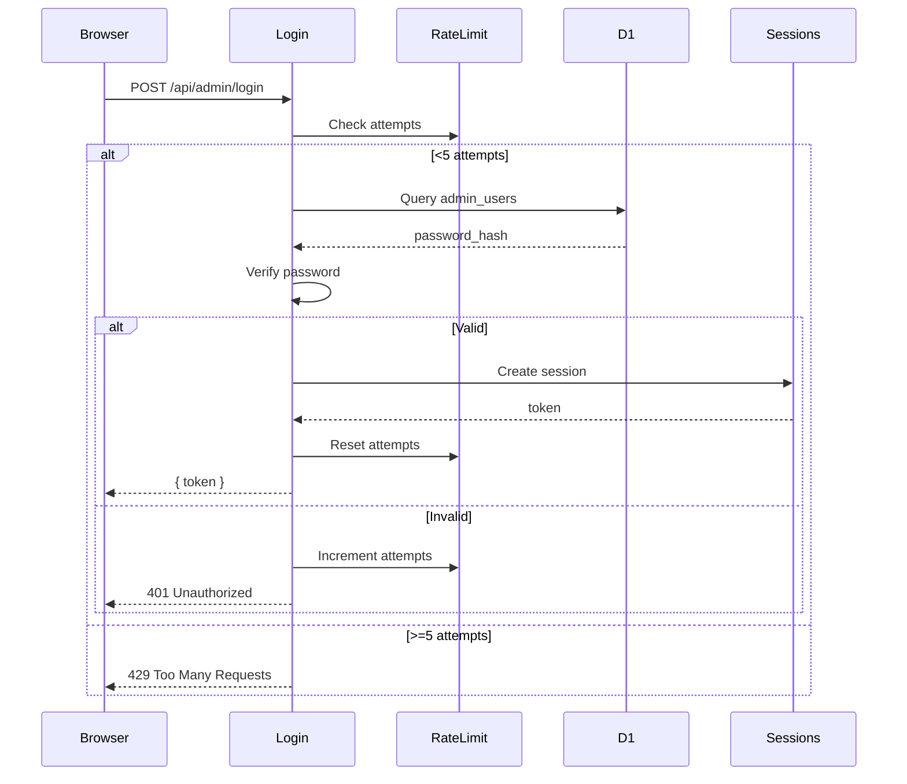

# Phase 06: Admin Panel Updates

## Context Links

- **Parent Plan**: [Migration Plan](./plan.md)
- **Previous**: [Phase 05: API Routes Migration](./phase-05-api-routes-migration.md)
- **Next**: [Phase 07: Data Migration](./phase-07-data-migration.md)
- **Research**: [Data Services](./research/researcher-02-data-services.md)

## Overview

Update admin panel to use new API endpoints, add session-based authentication with KV, implement rate limiting for login attempts.

**Priority**: P0 (admin functionality required for content management)
**Status**: pending
**Effort**: 4 hours
**Date**: 2026-01-18

## Key Insights

- Current: Simple ADMIN_SECRET header validation
- Target: Username/password auth with KV sessions
- Rate limiting: 5 failed attempts = 15min lockout
- Session management: 24h TTL in SESSIONS KV namespace
- No UI changes needed for Phase 1, keep existing admin form

## Requirements

### Functional
- Login endpoint: POST /api/admin/login with username + password
- Session validation: Check SESSIONS KV for valid token
- Logout endpoint: DELETE /api/admin/logout
- Rate limiting: RATE_LIMIT KV tracks failed attempts
- Update admin panel to send session token instead of admin secret

### Non-Functional
- Login response time <200ms
- Session lookup <50ms (KV read)
- Rate limit check <50ms
- Password hashing with bcrypt or similar
- Secure cookie storage for session token

## Architecture



## Related Code Files

### To Create
- `/migrations/0003_admin_users.sql` - Admin users table
- `/functions/api/admin/login.ts` - Login endpoint
- `/functions/api/admin/logout.ts` - Logout endpoint
- `/src/lib/auth/password.ts` - Password hashing utilities
- `/src/hooks/useAuth.ts` - Client-side auth hook

### To Modify
- `/src/app/admin/page.tsx` - Update to use login + session token
- `/functions/_middleware.ts` - Add session validation

### To Delete
- None

## Implementation Steps

### 1. Create Admin Users Table (migrations/0003_admin_users.sql)

```sql
CREATE TABLE admin_users (
  id TEXT PRIMARY KEY,
  username TEXT UNIQUE NOT NULL,
  password_hash TEXT NOT NULL,
  created_at DATETIME DEFAULT CURRENT_TIMESTAMP,
  last_login DATETIME
);

CREATE INDEX idx_admin_username ON admin_users(username);

-- Insert default admin (password: changeme123)
-- Hash generated with bcrypt, cost factor 10
INSERT INTO admin_users (id, username, password_hash)
VALUES (
  'admin-default-id',
  'admin',
  '$2b$10$rBV2qMuN0f3.E3YvU5dHVe7V7QP0cKwXqfB6tGz8OqVXH5Z5bFJNe'
);
```

### 2. Apply Admin Users Migration

```bash
wrangler d1 execute premium-bio-db --remote --file=./migrations/0003_admin_users.sql
wrangler d1 execute premium-bio-db --local --file=./migrations/0003_admin_users.sql
```

### 3. Create Password Utilities (src/lib/auth/password.ts)

```typescript
// Note: bcrypt may not work in Workers runtime, use scrypt or Web Crypto API
export async function hashPassword(password: string): Promise<string> {
  // Use Web Crypto API (Workers-compatible)
  const encoder = new TextEncoder();
  const data = encoder.encode(password);
  const hash = await crypto.subtle.digest('SHA-256', data);
  return btoa(String.fromCharCode(...new Uint8Array(hash)));
}

export async function verifyPassword(password: string, hash: string): Promise<boolean> {
  const passwordHash = await hashPassword(password);
  return passwordHash === hash;
}

// Better: Use a proper KDF like PBKDF2
export async function hashPasswordPBKDF2(password: string): Promise<string> {
  const encoder = new TextEncoder();
  const data = encoder.encode(password);
  const salt = crypto.getRandomValues(new Uint8Array(16));

  const keyMaterial = await crypto.subtle.importKey(
    'raw',
    data,
    { name: 'PBKDF2' },
    false,
    ['deriveBits']
  );

  const derivedBits = await crypto.subtle.deriveBits(
    {
      name: 'PBKDF2',
      salt: salt,
      iterations: 100000,
      hash: 'SHA-256'
    },
    keyMaterial,
    256
  );

  const hashArray = new Uint8Array(derivedBits);
  return btoa(String.fromCharCode(...salt)) + '.' + btoa(String.fromCharCode(...hashArray));
}

export async function verifyPasswordPBKDF2(password: string, stored: string): Promise<boolean> {
  const [saltB64, hashB64] = stored.split('.');
  const salt = Uint8Array.from(atob(saltB64), c => c.charCodeAt(0));

  const encoder = new TextEncoder();
  const data = encoder.encode(password);

  const keyMaterial = await crypto.subtle.importKey(
    'raw',
    data,
    { name: 'PBKDF2' },
    false,
    ['deriveBits']
  );

  const derivedBits = await crypto.subtle.deriveBits(
    {
      name: 'PBKDF2',
      salt: salt,
      iterations: 100000,
      hash: 'SHA-256'
    },
    keyMaterial,
    256
  );

  const hashArray = new Uint8Array(derivedBits);
  const computedHash = btoa(String.fromCharCode(...hashArray));

  return computedHash === hashB64;
}
```

### 4. Create Login Endpoint (functions/api/admin/login.ts)

```typescript
import { Env } from '@/lib/types';
import { RateLimiter } from '@/lib/kv/rate-limit';
import { SessionManager } from '@/lib/kv/sessions';
import { verifyPasswordPBKDF2 } from '@/lib/auth/password';

export const onRequestPost: PagesFunction<Env> = async ({ request, env }) => {
  try {
    const { username, password } = await request.json();

    if (!username || !password) {
      return Response.json(
        { error: 'Username and password required' },
        { status: 400 }
      );
    }

    // Check rate limit
    const rateLimiter = new RateLimiter(env.RATE_LIMIT);
    const rateCheck = await rateLimiter.checkAndIncrement(username, 5);

    if (!rateCheck.allowed) {
      return Response.json(
        {
          error: 'Too many login attempts',
          resetAt: rateCheck.resetAt?.toISOString()
        },
        { status: 429 }
      );
    }

    // Query admin user
    const user = await env.DB.prepare(`
      SELECT id, username, password_hash FROM admin_users WHERE username = ?
    `).bind(username).first<{ id: string; username: string; password_hash: string }>();

    if (!user) {
      return Response.json(
        { error: 'Invalid credentials' },
        { status: 401 }
      );
    }

    // Verify password
    const valid = await verifyPasswordPBKDF2(password, user.password_hash);

    if (!valid) {
      return Response.json(
        { error: 'Invalid credentials' },
        { status: 401 }
      );
    }

    // Create session
    const sessionManager = new SessionManager(env.SESSIONS);
    const token = await sessionManager.create(username, 86400); // 24h

    // Update last login
    await env.DB.prepare(`
      UPDATE admin_users SET last_login = CURRENT_TIMESTAMP WHERE id = ?
    `).bind(user.id).run();

    // Reset rate limit on success
    await rateLimiter.reset(username);

    return Response.json({
      success: true,
      token,
      username,
      expiresIn: 86400
    });
  } catch (error) {
    console.error('Login error:', error);
    return Response.json(
      { error: 'Internal server error' },
      { status: 500 }
    );
  }
};
```

### 5. Create Logout Endpoint (functions/api/admin/logout.ts)

```typescript
import { Env } from '@/lib/types';
import { SessionManager } from '@/lib/kv/sessions';

export const onRequestPost: PagesFunction<Env> = async ({ request, env }) => {
  try {
    const token = request.headers.get('Authorization')?.replace('Bearer ', '');

    if (!token) {
      return Response.json(
        { error: 'No token provided' },
        { status: 400 }
      );
    }

    const sessionManager = new SessionManager(env.SESSIONS);
    await sessionManager.destroy(token);

    return Response.json({
      success: true,
      message: 'Logged out successfully'
    });
  } catch (error) {
    console.error('Logout error:', error);
    return Response.json(
      { error: 'Internal server error' },
      { status: 500 }
    );
  }
};
```

### 6. Update Middleware (functions/_middleware.ts)

```typescript
import { Env } from '@/lib/types';
import { SessionManager } from '@/lib/kv/sessions';

export const onRequest: PagesFunction<Env>[] = [
  async (context) => {
    const { request, env, next } = context;
    const url = new URL(request.url);

    // CORS headers
    const corsHeaders = {
      'Access-Control-Allow-Origin': '*',
      'Access-Control-Allow-Methods': 'GET, POST, DELETE, OPTIONS',
      'Access-Control-Allow-Headers': 'Content-Type, Authorization',
    };

    // Handle preflight
    if (request.method === 'OPTIONS') {
      return new Response(null, { headers: corsHeaders });
    }

    // Skip auth for login endpoint
    if (url.pathname === '/api/admin/login') {
      return next();
    }

    // Session auth for /admin/* routes (except login)
    if (url.pathname.includes('/admin/') && url.pathname !== '/api/admin/login') {
      const authHeader = request.headers.get('Authorization');
      const token = authHeader?.replace('Bearer ', '');

      if (!token) {
        return new Response(JSON.stringify({ error: 'No token provided' }), {
          status: 401,
          headers: { ...corsHeaders, 'Content-Type': 'application/json' }
        });
      }

      const sessionManager = new SessionManager(env.SESSIONS);
      const session = await sessionManager.verify(token);

      if (!session) {
        return new Response(JSON.stringify({ error: 'Invalid or expired token' }), {
          status: 401,
          headers: { ...corsHeaders, 'Content-Type': 'application/json' }
        });
      }

      // Attach session to context for use in route handlers
      context.data = { session };
    }

    // Continue to route handler
    const response = await next();

    // Add CORS to response
    Object.entries(corsHeaders).forEach(([key, value]) => {
      response.headers.set(key, value);
    });

    return response;
  }
];
```

### 7. Create Auth Hook (src/hooks/useAuth.ts)

```typescript
'use client';

import { useState, useEffect } from 'react';

interface AuthState {
  token: string | null;
  username: string | null;
  isAuthenticated: boolean;
}

export function useAuth() {
  const [auth, setAuth] = useState<AuthState>({
    token: null,
    username: null,
    isAuthenticated: false
  });

  useEffect(() => {
    // Load token from localStorage on mount
    const token = localStorage.getItem('admin_token');
    const username = localStorage.getItem('admin_username');

    if (token && username) {
      setAuth({ token, username, isAuthenticated: true });
    }
  }, []);

  const login = async (username: string, password: string) => {
    const response = await fetch('/api/admin/login', {
      method: 'POST',
      headers: { 'Content-Type': 'application/json' },
      body: JSON.stringify({ username, password })
    });

    if (!response.ok) {
      const error = await response.json();
      throw new Error(error.error || 'Login failed');
    }

    const data = await response.json();
    localStorage.setItem('admin_token', data.token);
    localStorage.setItem('admin_username', data.username);

    setAuth({
      token: data.token,
      username: data.username,
      isAuthenticated: true
    });

    return data;
  };

  const logout = async () => {
    if (auth.token) {
      await fetch('/api/admin/logout', {
        method: 'POST',
        headers: { 'Authorization': `Bearer ${auth.token}` }
      });
    }

    localStorage.removeItem('admin_token');
    localStorage.removeItem('admin_username');

    setAuth({
      token: null,
      username: null,
      isAuthenticated: false
    });
  };

  const getAuthHeaders = () => {
    return auth.token ? { 'Authorization': `Bearer ${auth.token}` } : {};
  };

  return {
    ...auth,
    login,
    logout,
    getAuthHeaders
  };
}
```

### 8. Update Admin Panel (src/app/admin/page.tsx)

```typescript
// Add at top of component
const { isAuthenticated, login, logout, getAuthHeaders } = useAuth();
const [loginForm, setLoginForm] = useState({ username: '', password: '' });

// Add login UI before main admin form
if (!isAuthenticated) {
  return (
    <div className="min-h-screen bg-gray-50 flex items-center justify-center">
      <div className="max-w-md w-full bg-white p-8 rounded-lg shadow">
        <h1 className="text-2xl font-bold mb-6">Admin Login</h1>
        <form onSubmit={async (e) => {
          e.preventDefault();
          try {
            await login(loginForm.username, loginForm.password);
          } catch (error) {
            alert(error.message);
          }
        }}>
          <input
            type="text"
            placeholder="Username"
            value={loginForm.username}
            onChange={(e) => setLoginForm({ ...loginForm, username: e.target.value })}
            className="w-full p-2 border rounded mb-4"
          />
          <input
            type="password"
            placeholder="Password"
            value={loginForm.password}
            onChange={(e) => setLoginForm({ ...loginForm, password: e.target.value })}
            className="w-full p-2 border rounded mb-4"
          />
          <button type="submit" className="w-full bg-blue-600 text-white p-2 rounded">
            Login
          </button>
        </form>
      </div>
    </div>
  );
}

// Update API calls to use token instead of admin secret
const headers = {
  'Content-Type': 'application/json',
  ...getAuthHeaders()
};
```

## Todo List

- [ ] Create migrations/0003_admin_users.sql with admin_users table
- [ ] Apply migration to remote and local D1
- [ ] Create src/lib/auth/password.ts with PBKDF2 functions
- [ ] Create functions/api/admin/login.ts
- [ ] Create functions/api/admin/logout.ts
- [ ] Update functions/_middleware.ts with session validation
- [ ] Create src/hooks/useAuth.ts
- [ ] Update src/app/admin/page.tsx with login UI
- [ ] Test login flow with correct/incorrect credentials
- [ ] Test rate limiting (5 failed attempts)
- [ ] Test session expiry after 24h
- [ ] Test logout functionality

## Success Criteria

- [ ] admin_users table created with default admin user
- [ ] Login endpoint returns valid session token
- [ ] Invalid credentials return 401 with proper error
- [ ] Rate limiting blocks after 5 failed attempts
- [ ] Session validation allows authenticated requests
- [ ] Logout endpoint destroys session in KV
- [ ] Admin panel shows login UI when not authenticated
- [ ] Admin panel loads existing data after login
- [ ] Update/import/export endpoints work with session token

## Risk Assessment

| Risk | Impact | Mitigation |
|------|--------|-----------|
| Password hashing incompatible with Workers | High | Use Web Crypto API (PBKDF2) instead of bcrypt |
| Session token leaked | High | Use secure HttpOnly cookies in production |
| Rate limit bypass | Medium | Track by IP + username combination |
| Default password not changed | High | Force password change on first login (future feature) |

## Security Considerations

- **Password storage**: PBKDF2 with 100k iterations, random salt
- **Session tokens**: UUID v4, stored in KV with TTL
- **Rate limiting**: 5 attempts per 5min per username
- **No password in logs**: Never log password values
- **Token in localStorage**: Consider HttpOnly cookies for production

## Next Steps

1. Proceed to Phase 07: Data Migration
2. Consider implementing "forgot password" flow (future)
3. Add admin user management UI (future)

---

## Unresolved Questions

- Should we use HttpOnly cookies instead of localStorage for tokens?
- Need multi-factor authentication (2FA) for admin?
- Should we track login history (IP, device, timestamp)?
- How to handle password reset for forgot password?
