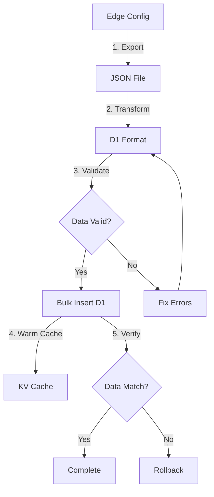

# Phase 07: Data Migration

## Context Links

- **Parent Plan**: [Migration Plan](./plan.md)
- **Previous**: [Phase 06: Admin Panel Updates](./phase-06-admin-panel-updates.md)
- **Next**: [Phase 08: Build & Deploy Config](./phase-08-build-deploy-config.md)
- **Research**: [Data Services](./research/researcher-02-data-services.md)

## Overview

Export existing Edge Config data, transform to D1 schema format, bulk insert into database, warm KV cache. Implement dual-write strategy for safe cutover.

**Priority**: P0 (cannot go live without data)
**Status**: pending
**Effort**: 3 hours
**Date**: 2026-01-18

## Key Insights

- Current data in Edge Config under key `bioData[domain]`
- Must preserve all profile, links, products, aiTools data
- Use atomic D1 batch operations to prevent partial writes
- Dual-write period: Write to both Edge Config + D1, read from D1
- Rollback plan: Revert to Edge Config read if D1 issues

## Requirements

### Functional
- Export script: Fetch data from Edge Config API
- Transform script: Convert BioData to D1 row format
- Import script: Bulk insert into D1 with error handling
- Validation script: Compare Edge Config vs D1 data
- Backup: Save Edge Config export to JSON file

### Non-Functional
- Migration completes in <5 minutes for typical dataset
- Zero data loss during migration
- Atomic inserts (all or nothing)
- Rollback capability within 24h

## Architecture



## Related Code Files

### To Create
- `/scripts/migrate-edge-config-to-d1.ts` - Migration script
- `/scripts/export-edge-config.ts` - Export utility
- `/scripts/validate-migration.ts` - Validation utility
- `/data/backups/edge-config-backup-{date}.json` - Backup file

### To Modify
- None

### To Delete
- None (keep Edge Config as backup)

## Implementation Steps

### 1. Create Export Script (scripts/export-edge-config.ts)

```typescript
import { config } from 'dotenv';
import { writeFileSync } from 'fs';

config({ path: '.env.local' });

async function exportEdgeConfig() {
  const edgeConfigId = process.env.EDGE_CONFIG_ID;
  const edgeConfigToken = process.env.EDGE_CONFIG_TOKEN;

  if (!edgeConfigId || !edgeConfigToken) {
    throw new Error('Missing EDGE_CONFIG_ID or EDGE_CONFIG_TOKEN');
  }

  // Fetch all items from Edge Config
  const response = await fetch(
    `https://api.vercel.com/v1/edge-config/${edgeConfigId}/items`,
    {
      headers: {
        'Authorization': `Bearer ${edgeConfigToken}`,
      }
    }
  );

  if (!response.ok) {
    throw new Error(`Failed to fetch Edge Config: ${response.statusText}`);
  }

  const data = await response.json();
  console.log('Exported Edge Config items:', Object.keys(data));

  // Save backup
  const timestamp = new Date().toISOString().replace(/:/g, '-').split('.')[0];
  const backupPath = `./data/backups/edge-config-backup-${timestamp}.json`;

  writeFileSync(backupPath, JSON.stringify(data, null, 2));
  console.log(`Backup saved to: ${backupPath}`);

  return data;
}

// Run if called directly
if (require.main === module) {
  exportEdgeConfig()
    .then(() => console.log('Export complete'))
    .catch(console.error);
}

export { exportEdgeConfig };
```

### 2. Create Migration Script (scripts/migrate-edge-config-to-d1.ts)

```typescript
import { config } from 'dotenv';
import { exportEdgeConfig } from './export-edge-config';
import { BioData } from '../src/lib/types';

config({ path: '.env.local' });

interface D1Response {
  success: boolean;
  meta: any;
  results?: any[];
}

async function executeD1Query(query: string, params: any[] = []): Promise<D1Response> {
  // Use wrangler CLI to execute D1 queries
  // This is a placeholder - actual implementation depends on environment
  const { exec } = require('child_process');
  const util = require('util');
  const execPromise = util.promisify(exec);

  const bindParams = params.map(p => `--param="${p}"`).join(' ');
  const cmd = `wrangler d1 execute premium-bio-db --remote --command="${query}" ${bindParams}`;

  const { stdout, stderr } = await execPromise(cmd);

  if (stderr) {
    console.error('D1 Error:', stderr);
    throw new Error(stderr);
  }

  return { success: true, meta: {}, results: [] };
}

async function migrateToD1(edgeConfigData: any) {
  const bioData = edgeConfigData.bioData || {};
  const domain = process.env.DOMAIN || 'default';

  console.log(`Migrating data for domain: ${domain}`);

  const domainData: BioData = bioData[domain];

  if (!domainData) {
    console.log(`No data found for domain: ${domain}`);
    return;
  }

  console.log('Data structure:', {
    profile: !!domainData.profile,
    links: domainData.links?.length || 0,
    products: domainData.products?.length || 0,
    aiTools: domainData.aiTools?.length || 0,
    socialLinks: domainData.profile?.socialLinks?.length || 0
  });

  // Generate profile ID
  const profileId = `profile-${domain}`;

  // 1. Insert profile
  await executeD1Query(`
    INSERT OR REPLACE INTO profiles (id, username, display_name, tagline, avatar_url, cover_url)
    VALUES (?, ?, ?, ?, ?, ?)
  `, [
    profileId,
    domain,
    domainData.profile.name,
    domainData.profile.tagline || '',
    domainData.profile.avatar || '',
    domainData.profile.coverImage || ''
  ]);

  console.log('✓ Profile inserted');

  // 2. Clear existing related data
  await executeD1Query(`DELETE FROM social_links WHERE profile_id = ?`, [profileId]);
  await executeD1Query(`DELETE FROM bio_links WHERE profile_id = ?`, [profileId]);
  await executeD1Query(`DELETE FROM products WHERE profile_id = ?`, [profileId]);
  await executeD1Query(`DELETE FROM carousel_items WHERE profile_id = ?`, [profileId]);

  console.log('✓ Existing data cleared');

  // 3. Insert social links
  for (let i = 0; i < (domainData.profile.socialLinks || []).length; i++) {
    const link = domainData.profile.socialLinks[i];
    await executeD1Query(`
      INSERT INTO social_links (id, profile_id, platform, url, icon, order_index)
      VALUES (?, ?, ?, ?, ?, ?)
    `, [
      `social-${profileId}-${i}`,
      profileId,
      link.name,
      link.url,
      link.icon || '',
      i
    ]);
  }

  console.log(`✓ ${domainData.profile.socialLinks?.length || 0} social links inserted`);

  // 4. Insert bio links
  for (let i = 0; i < (domainData.links || []).length; i++) {
    const link = domainData.links[i];
    await executeD1Query(`
      INSERT INTO bio_links (id, profile_id, name, url, description, background_image, order_index)
      VALUES (?, ?, ?, ?, ?, ?, ?)
    `, [
      `biolink-${profileId}-${i}`,
      profileId,
      link.name,
      link.url,
      link.description || '',
      link.backgroundImage || '',
      i
    ]);
  }

  console.log(`✓ ${domainData.links?.length || 0} bio links inserted`);

  // 5. Insert products
  for (let i = 0; i < (domainData.products || []).length; i++) {
    const product = domainData.products[i];
    await executeD1Query(`
      INSERT INTO products (id, profile_id, name, image_url, price, url, order_index)
      VALUES (?, ?, ?, ?, ?, ?, ?)
    `, [
      `product-${profileId}-${i}`,
      profileId,
      product.name,
      product.image || '',
      product.price,
      product.url,
      i
    ]);
  }

  console.log(`✓ ${domainData.products?.length || 0} products inserted`);

  // 6. Insert carousel items (AI tools)
  for (let i = 0; i < (domainData.aiTools || []).length; i++) {
    const tool = domainData.aiTools[i];
    await executeD1Query(`
      INSERT INTO carousel_items (id, profile_id, name, logo_url, url, order_index)
      VALUES (?, ?, ?, ?, ?, ?)
    `, [
      `carousel-${profileId}-${i}`,
      profileId,
      tool.name,
      tool.logo || '',
      tool.url,
      i
    ]);
  }

  console.log(`✓ ${domainData.aiTools?.length || 0} carousel items inserted`);

  console.log('✅ Migration complete!');
}

// Run if called directly
if (require.main === module) {
  exportEdgeConfig()
    .then(data => migrateToD1(data))
    .then(() => console.log('✅ All done!'))
    .catch(error => {
      console.error('❌ Migration failed:', error);
      process.exit(1);
    });
}

export { migrateToD1 };
```

### 3. Create Validation Script (scripts/validate-migration.ts)

```typescript
import { config } from 'dotenv';
import { exportEdgeConfig } from './export-edge-config';

config({ path: '.env.local' });

async function validateMigration() {
  // 1. Fetch Edge Config data
  const edgeConfigData = await exportEdgeConfig();
  const domain = process.env.DOMAIN || 'default';
  const edgeData = edgeConfigData.bioData?.[domain];

  if (!edgeData) {
    console.log('No Edge Config data to validate');
    return;
  }

  // 2. Fetch D1 data via API
  const apiUrl = process.env.API_URL || 'http://localhost:8788';
  const response = await fetch(`${apiUrl}/api/config`);

  if (!response.ok) {
    throw new Error(`Failed to fetch D1 data: ${response.statusText}`);
  }

  const d1Data = await response.json();

  // 3. Compare counts
  const comparison = {
    profile: {
      edge: edgeData.profile.name,
      d1: d1Data.profile.name,
      match: edgeData.profile.name === d1Data.profile.name
    },
    socialLinks: {
      edge: edgeData.profile.socialLinks?.length || 0,
      d1: d1Data.profile.socialLinks?.length || 0,
      match: (edgeData.profile.socialLinks?.length || 0) === (d1Data.profile.socialLinks?.length || 0)
    },
    links: {
      edge: edgeData.links?.length || 0,
      d1: d1Data.links?.length || 0,
      match: (edgeData.links?.length || 0) === (d1Data.links?.length || 0)
    },
    products: {
      edge: edgeData.products?.length || 0,
      d1: d1Data.products?.length || 0,
      match: (edgeData.products?.length || 0) === (d1Data.products?.length || 0)
    },
    aiTools: {
      edge: edgeData.aiTools?.length || 0,
      d1: d1Data.aiTools?.length || 0,
      match: (edgeData.aiTools?.length || 0) === (d1Data.aiTools?.length || 0)
    }
  };

  console.log('Validation Results:');
  console.table(comparison);

  const allMatch = Object.values(comparison).every(c => c.match);

  if (allMatch) {
    console.log('✅ Validation passed! Data matches.');
  } else {
    console.log('❌ Validation failed! Data mismatch detected.');
    process.exit(1);
  }
}

// Run if called directly
if (require.main === module) {
  validateMigration()
    .then(() => console.log('Validation complete'))
    .catch(console.error);
}

export { validateMigration };
```

### 4. Create Backup Directory

```bash
mkdir -p /Users/mbpprm/Documents/mybuild/for-free/premium-bio-website/data/backups
```

### 5. Run Migration

```bash
# 1. Export Edge Config (creates backup)
npx tsx scripts/export-edge-config.ts

# 2. Run migration to D1
npx tsx scripts/migrate-edge-config-to-d1.ts

# 3. Validate migration
npx tsx scripts/validate-migration.ts
```

### 6. Alternative: Use Admin Import API

```bash
# Export Edge Config data
curl -H "Authorization: Bearer $EDGE_CONFIG_TOKEN" \
  https://api.vercel.com/v1/edge-config/$EDGE_CONFIG_ID/items \
  > edge-config-backup.json

# Import via admin API
curl -X POST http://localhost:8788/api/admin/import \
  -H "Content-Type: application/json" \
  -H "Authorization: Bearer YOUR_SESSION_TOKEN" \
  -d @edge-config-backup.json
```

### 7. Warm KV Cache

```bash
# Trigger config endpoint to populate cache
curl http://localhost:8788/api/config
```

### 8. Add to package.json Scripts

```json
{
  "scripts": {
    "migrate:export": "tsx scripts/export-edge-config.ts",
    "migrate:d1": "tsx scripts/migrate-edge-config-to-d1.ts",
    "migrate:validate": "tsx scripts/validate-migration.ts",
    "migrate:all": "npm run migrate:export && npm run migrate:d1 && npm run migrate:validate"
  }
}
```

## Todo List

- [ ] Create data/backups directory
- [ ] Create scripts/export-edge-config.ts
- [ ] Create scripts/migrate-edge-config-to-d1.ts
- [ ] Create scripts/validate-migration.ts
- [ ] Add migration scripts to package.json
- [ ] Install tsx dependency (npm install -D tsx)
- [ ] Run export script to create backup
- [ ] Run migration script to import to D1
- [ ] Run validation script to verify data
- [ ] Warm KV cache by calling /api/config
- [ ] Test admin panel with migrated data
- [ ] Keep Edge Config backup for 30 days

## Success Criteria

- [ ] Edge Config data exported to JSON backup file
- [ ] All profiles, links, products, tools migrated to D1
- [ ] Validation script reports 100% data match
- [ ] GET /api/config returns correct data from D1
- [ ] Admin panel loads migrated data correctly
- [ ] KV cache populated after first request
- [ ] Zero data loss during migration

## Risk Assessment

| Risk | Impact | Mitigation |
|------|--------|-----------|
| Migration script failure | High | Atomic operations, keep Edge Config backup |
| Data transformation errors | High | Validation script catches mismatches |
| Partial write to D1 | High | Use DELETE before INSERT for cleanup |
| Cache warming slow | Low | Async background job after migration |

## Security Considerations

- **Backup file**: Store in .gitignore, contains production data
- **API tokens**: Never commit .env.local with tokens
- **Migration logs**: Don't log sensitive data (passwords, tokens)

## Next Steps

1. Proceed to Phase 08: Build & Deploy Config
2. Keep Edge Config read-only for 48h as safety net
3. Monitor D1 query performance after migration

---

## Unresolved Questions

- Should we implement incremental migration for large datasets?
- Need automated rollback script if migration fails?
- How to handle multi-domain migration (loop through all domains)?
- Should we archive Edge Config after successful cutover?
