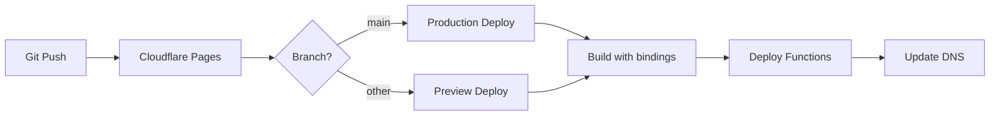

# Phase 08: Build & Deploy Config

## Context Links

- **Parent Plan**: [Migration Plan](./plan.md)
- **Previous**: [Phase 07: Data Migration](./phase-07-data-migration.md)
- **Next**: [Phase 09: Testing & Validation](./phase-09-testing-validation.md)
- **Research**: [Pages Deployment](./research/researcher-01-pages-deployment.md)

## Overview

Configure Next.js for Cloudflare Pages, update build settings, set environment variables, configure wrangler.toml for production, setup CI/CD pipeline.

**Priority**: P0 (required for deployment)
**Status**: pending
**Effort**: 2 hours
**Date**: 2026-01-18

## Key Insights

- Next.js requires `output: 'standalone'` for Pages Functions
- Pages auto-detects framework, minimal config needed
- Environment variables set per environment (production/preview)
- wrangler.toml defines bindings for D1, KV, R2
- GitHub Actions can automate deployment

## Requirements

### Functional
- next.config.js updated with standalone output
- wrangler.toml with complete bindings
- Environment variables configured in dashboard
- Build succeeds locally and in Pages
- Deployment script for production

### Non-Functional
- Build time <5 minutes
- Build output <50MB
- Zero downtime deployment
- Preview deployments for PRs

## Architecture



## Related Code Files

### To Create
- `/.github/workflows/deploy.yml` - GitHub Actions CI/CD
- `/scripts/deploy.sh` - Deployment script

### To Modify
- `/next.config.js` - Add standalone output
- `/wrangler.toml` - Complete bindings configuration
- `/.gitignore` - Add build artifacts

### To Delete
- None

## Implementation Steps

### 1. Update next.config.js

```javascript
/** @type {import('next').NextConfig} */
const nextConfig = {
  output: 'standalone', // Required for Pages Functions
  typescript: {
    ignoreBuildErrors: true,
  },
  eslint: {
    ignoreDuringBuilds: true,
  },
  images: {
    remotePatterns: [
      {
        protocol: 'https',
        hostname: process.env.DOMAIN || '**',
      },
      {
        protocol: 'https',
        hostname: 'images.unsplash.com',
      },
      {
        protocol: 'https',
        hostname: 'res.cloudinary.com',
      },
      {
        protocol: 'https',
        hostname: '*.r2.cloudflarestorage.com', // R2 public URLs
      }
    ],
  },
  // Cloudflare Pages compatibility
  experimental: {
    serverActions: {
      allowedOrigins: ['*.pages.dev', process.env.DOMAIN]
    }
  }
}

module.exports = nextConfig
```

### 2. Complete wrangler.toml

```toml
name = "premium-bio-website"
compatibility_date = "2024-01-01"
compatibility_flags = ["nodejs_compat"]
pages_build_output_dir = "./out"

# Production environment
[env.production]
name = "premium-bio-website"

# D1 Database
[[env.production.d1_databases]]
binding = "DB"
database_name = "premium-bio-db"
database_id = "<YOUR_D1_DATABASE_ID>"

# KV Namespaces
[[env.production.kv_namespaces]]
binding = "CONFIG_CACHE"
id = "<YOUR_CONFIG_CACHE_ID>"

[[env.production.kv_namespaces]]
binding = "SESSIONS"
id = "<YOUR_SESSIONS_ID>"

[[env.production.kv_namespaces]]
binding = "RATE_LIMIT"
id = "<YOUR_RATE_LIMIT_ID>"

# R2 Bucket
[[env.production.r2_buckets]]
binding = "MEDIA"
bucket_name = "bio-media"

# Preview environment (for PRs)
[env.preview]
name = "premium-bio-website-preview"

[[env.preview.d1_databases]]
binding = "DB"
database_name = "premium-bio-db"
database_id = "<YOUR_D1_DATABASE_ID>"
preview_database_id = "<YOUR_D1_DATABASE_ID>"

[[env.preview.kv_namespaces]]
binding = "CONFIG_CACHE"
id = "<YOUR_CONFIG_CACHE_ID>"
preview_id = "<YOUR_CONFIG_CACHE_ID>"

[[env.preview.kv_namespaces]]
binding = "SESSIONS"
id = "<YOUR_SESSIONS_ID>"
preview_id = "<YOUR_SESSIONS_ID>"

[[env.preview.kv_namespaces]]
binding = "RATE_LIMIT"
id = "<YOUR_RATE_LIMIT_ID>"
preview_id = "<YOUR_RATE_LIMIT_ID>"

[[env.preview.r2_buckets]]
binding = "MEDIA"
bucket_name = "bio-media"
preview_bucket_name = "bio-media"
```

### 3. Configure Environment Variables in Dashboard

```bash
# Via Cloudflare Dashboard: Workers & Pages > premium-bio-website > Settings > Environment Variables

# Production variables:
ADMIN_SECRET=<secure-random-string>
DOMAIN=yourdomain.com
NODE_ENV=production
R2_PUBLIC_DOMAIN=media.yourdomain.com

# Preview variables (same as production for now):
ADMIN_SECRET=<preview-secret>
DOMAIN=preview.yourdomain.com
NODE_ENV=preview
```

### 4. Or Set via CLI

```bash
# Set production secrets
wrangler pages secret put ADMIN_SECRET --project-name=premium-bio-website --env=production
wrangler pages secret put DOMAIN --project-name=premium-bio-website --env=production

# Set preview secrets
wrangler pages secret put ADMIN_SECRET --project-name=premium-bio-website --env=preview
wrangler pages secret put DOMAIN --project-name=premium-bio-website --env=preview
```

### 5. Update .gitignore

```gitignore
# Cloudflare
.dev.vars
.wrangler/
wrangler.toml.bak
dist/

# Next.js
/.next/
/out/
.next/
out/

# Build
.vercel
```

### 6. Create Deployment Script (scripts/deploy.sh)

```bash
#!/bin/bash
set -e

echo "🚀 Starting deployment to Cloudflare Pages..."

# 1. Run linting (optional)
# echo "📝 Linting code..."
# npm run lint

# 2. Run tests (optional)
# echo "🧪 Running tests..."
# npm test

# 3. Build project
echo "🔨 Building project..."
npm run build

# 4. Deploy to Cloudflare Pages
echo "☁️ Deploying to Cloudflare..."
npx wrangler pages deploy ./out --project-name=premium-bio-website --branch=main

echo "✅ Deployment complete!"
echo "🌐 Visit: https://premium-bio-website.pages.dev"
```

### 7. Make Script Executable

```bash
chmod +x scripts/deploy.sh
```

### 8. Create GitHub Actions Workflow (.github/workflows/deploy.yml)

```yaml
name: Deploy to Cloudflare Pages

on:
  push:
    branches:
      - main
  pull_request:
    branches:
      - main

jobs:
  deploy:
    runs-on: ubuntu-latest
    name: Deploy to Cloudflare Pages
    steps:
      - name: Checkout
        uses: actions/checkout@v4

      - name: Setup Node
        uses: actions/setup-node@v4
        with:
          node-version: '18'
          cache: 'npm'

      - name: Install dependencies
        run: npm ci

      - name: Build
        run: npm run build

      - name: Deploy to Cloudflare Pages
        uses: cloudflare/pages-action@v1
        with:
          apiToken: ${{ secrets.CLOUDFLARE_API_TOKEN }}
          accountId: ${{ secrets.CLOUDFLARE_ACCOUNT_ID }}
          projectName: premium-bio-website
          directory: out
          gitHubToken: ${{ secrets.GITHUB_TOKEN }}
          branch: ${{ github.ref_name }}
```

### 9. Add GitHub Secrets

```bash
# In GitHub repo: Settings > Secrets and variables > Actions

# Add secrets:
CLOUDFLARE_API_TOKEN=<your-cloudflare-api-token>
CLOUDFLARE_ACCOUNT_ID=<your-cloudflare-account-id>
```

### 10. Test Local Build

```bash
# Clean build
rm -rf .next out

# Build for production
npm run build

# Verify output
ls -lh out/

# Test with wrangler
npx wrangler pages dev ./out
```

### 11. Manual Deploy (First Time)

```bash
# Deploy to production
npm run build
npx wrangler pages deploy ./out --project-name=premium-bio-website --branch=main

# Note the deployment URL
# Example: https://premium-bio-website.pages.dev
```

### 12. Configure Custom Domain (Optional)

```bash
# Via dashboard: Workers & Pages > premium-bio-website > Custom domains
# Add domain: yourdomain.com
# Add CNAME record in DNS: yourdomain.com -> premium-bio-website.pages.dev
```

## Todo List

- [ ] Update next.config.js with standalone output
- [ ] Complete wrangler.toml with all bindings and IDs
- [ ] Configure environment variables in dashboard (or via CLI)
- [ ] Update .gitignore with Cloudflare patterns
- [ ] Create scripts/deploy.sh deployment script
- [ ] Make deploy.sh executable (chmod +x)
- [ ] Create .github/workflows/deploy.yml
- [ ] Add CLOUDFLARE_API_TOKEN and CLOUDFLARE_ACCOUNT_ID to GitHub secrets
- [ ] Test local build (npm run build)
- [ ] Test local deployment (npx wrangler pages dev ./out)
- [ ] Manual deploy to production (npx wrangler pages deploy)
- [ ] Verify deployment at *.pages.dev URL

## Success Criteria

- [ ] npm run build succeeds without errors
- [ ] Build output exists in ./out directory
- [ ] Local wrangler pages dev runs successfully
- [ ] Manual deployment to Pages succeeds
- [ ] Production site accessible at *.pages.dev
- [ ] Environment variables loaded correctly
- [ ] D1, KV, R2 bindings work in production
- [ ] GitHub Actions workflow triggers on push

## Risk Assessment

| Risk | Impact | Mitigation |
|------|--------|-----------|
| Build timeout (20min limit) | High | Optimize build, use caching, tree-shake unused deps |
| Environment variables missing | High | Document all required vars, check before deploy |
| Bindings misconfigured | High | Test locally first, verify IDs in wrangler.toml |
| Deploy fails on first attempt | Medium | Use manual deploy first, then enable CI/CD |

## Security Considerations

- **Never commit .dev.vars** with secrets
- **Use GitHub encrypted secrets** for CI/CD tokens
- **Rotate ADMIN_SECRET** after initial setup
- **Restrict API token scope** to Pages only

## Next Steps

1. Proceed to Phase 09: Testing & Validation
2. Monitor first production deployment
3. Setup custom domain after testing passes

---

## Unresolved Questions

- Should we use preview environments for each PR?
- Need staging environment separate from preview?
- How to handle database migrations in CI/CD?
- Should we implement blue-green deployment strategy?
