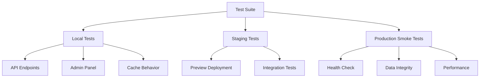

# Phase 09: Testing & Validation

## Context Links

- **Parent Plan**: [Migration Plan](./plan.md)
- **Previous**: [Phase 08: Build & Deploy Config](./phase-08-build-deploy-config.md)
- **Next**: [Phase 10: Cleanup & Documentation](./phase-10-cleanup-documentation.md)
- **Research**: All research reports

## Overview

Comprehensive testing of all endpoints, admin panel, data integrity, performance benchmarks, and production smoke tests.

**Priority**: P0 (must validate before production cutover)
**Status**: pending
**Effort**: 4 hours
**Date**: 2026-01-18

## Key Insights

- Test all 4 API endpoints: config, update, import, export
- Validate admin authentication and session management
- Check rate limiting behavior (5 attempts)
- Verify cache hit/miss performance
- Test data migration integrity
- Smoke test production deployment

## Requirements

### Functional
- All API endpoints return correct responses
- Admin login/logout flow works
- Rate limiting blocks after 5 attempts
- Cache reduces response time
- Data matches Edge Config backup
- UI displays correctly

### Non-Functional
- GET /api/config <100ms (cached)
- POST /api/admin/update <500ms
- Admin login <200ms
- Page load <2s
- Zero JavaScript errors in console
- Mobile responsive

## Architecture



## Related Code Files

### To Create
- `/tests/api/config.test.ts` - Config endpoint tests
- `/tests/api/admin.test.ts` - Admin endpoint tests
- `/tests/integration/migration.test.ts` - Migration validation
- `/tests/e2e/admin-flow.spec.ts` - E2E admin tests (Playwright)
- `/scripts/smoke-test.sh` - Production smoke test script

### To Modify
- None

### To Delete
- None

## Implementation Steps

### 1. Test Local Development

```bash
# Start local dev server
npm run build
npx wrangler pages dev ./out

# Verify bindings loaded
# Check console for: DB, CONFIG_CACHE, SESSIONS, RATE_LIMIT, MEDIA
```

### 2. Test GET /api/config

```bash
# Test endpoint
curl http://localhost:8788/api/config | jq

# Expected response:
# {
#   "profile": { "name": "...", "tagline": "...", ... },
#   "links": [...],
#   "products": [...],
#   "aiTools": [...]
# }

# Verify all fields present
# Check response time <100ms (after first request - cache warm)
```

### 3. Test Admin Login

```bash
# Test with correct credentials
curl -X POST http://localhost:8788/api/admin/login \
  -H "Content-Type: application/json" \
  -d '{"username":"admin","password":"changeme123"}' | jq

# Expected response:
# {
#   "success": true,
#   "token": "...",
#   "username": "admin",
#   "expiresIn": 86400
# }

# Save token for next tests
TOKEN="<token-from-response>"

# Test with incorrect credentials
curl -X POST http://localhost:8788/api/admin/login \
  -H "Content-Type: application/json" \
  -d '{"username":"admin","password":"wrong"}' | jq

# Expected: 401 Unauthorized
```

### 4. Test Rate Limiting

```bash
# Make 6 failed login attempts
for i in {1..6}; do
  echo "Attempt $i:"
  curl -X POST http://localhost:8788/api/admin/login \
    -H "Content-Type: application/json" \
    -d '{"username":"admin","password":"wrong"}'
  echo ""
done

# 6th attempt should return 429 Too Many Requests
```

### 5. Test POST /api/admin/update

```bash
# Update profile data
curl -X POST http://localhost:8788/api/admin/update \
  -H "Content-Type: application/json" \
  -H "Authorization: Bearer $TOKEN" \
  -d '{
    "bioData": {
      "profile": {
        "name": "Test Profile",
        "tagline": "Testing migration",
        "avatar": "https://images.unsplash.com/photo-1535713875002-d1d0cf377fde",
        "coverImage": "https://images.unsplash.com/photo-1579546929518-9e396f3cc809",
        "socialLinks": []
      },
      "links": [],
      "products": [],
      "aiTools": []
    }
  }' | jq

# Expected response:
# {
#   "success": true,
#   "message": "Configuration updated successfully"
# }

# Verify update
curl http://localhost:8788/api/config | jq .profile.name
# Expected: "Test Profile"
```

### 6. Test POST /api/admin/import

```bash
# Import from backup file
curl -X POST http://localhost:8788/api/admin/import \
  -H "Content-Type: application/json" \
  -H "Authorization: Bearer $TOKEN" \
  -d @data/backups/edge-config-backup-*.json | jq

# Verify import
curl http://localhost:8788/api/config | jq
```

### 7. Test GET /api/admin/export

```bash
# Export current data
curl http://localhost:8788/api/admin/export \
  -H "Authorization: Bearer $TOKEN" | jq

# Verify bioData field present
# Save for backup
```

### 8. Test Cache Behavior

```bash
# Clear cache manually (optional)
# wrangler kv:key delete --binding=CONFIG_CACHE "profile:default"

# First request (cache miss)
time curl http://localhost:8788/api/config > /dev/null
# Note response time (e.g., 150ms)

# Second request (cache hit)
time curl http://localhost:8788/api/config > /dev/null
# Note response time (should be <50ms)

# Verify cache invalidation after update
curl -X POST http://localhost:8788/api/admin/update \
  -H "Content-Type: application/json" \
  -H "Authorization: Bearer $TOKEN" \
  -d '{"bioData": {...}}'

# Next request should be cache miss again
time curl http://localhost:8788/api/config > /dev/null
```

### 9. Test Admin Panel UI

```bash
# Open in browser
open http://localhost:8788/admin

# Test login flow:
# 1. Enter username: admin
# 2. Enter password: changeme123
# 3. Click Login
# 4. Verify redirect to admin dashboard
# 5. Verify existing data loads in form
# 6. Make a change and click Update
# 7. Verify success message
# 8. Refresh page, verify data persists

# Test logout:
# 1. Click Logout button (if exists)
# 2. Verify redirect to login page
# 3. Verify token removed from localStorage
```

### 10. Test Main Bio Page UI

```bash
# Open in browser
open http://localhost:8788

# Verify:
# - Profile name, tagline, avatar, cover displayed
# - Social links clickable
# - Bio links displayed with images
# - Products displayed with images and prices
# - Carousel swipes correctly
# - Mobile responsive (resize browser)
# - No console errors
```

### 11. Deploy to Staging/Preview

```bash
# Deploy to preview environment
npx wrangler pages deploy ./out --project-name=premium-bio-website --branch=staging

# Note preview URL (e.g., staging.premium-bio-website.pages.dev)
```

### 12. Run Smoke Tests on Preview

```bash
# Create smoke test script
cat > scripts/smoke-test.sh << 'EOF'
#!/bin/bash
set -e

BASE_URL=${1:-"https://staging.premium-bio-website.pages.dev"}

echo "🧪 Running smoke tests on $BASE_URL..."

# Test 1: Health check
echo "1. Testing GET /api/config..."
response=$(curl -s -o /dev/null -w "%{http_code}" "$BASE_URL/api/config")
if [ "$response" != "200" ]; then
  echo "❌ Config endpoint failed: $response"
  exit 1
fi
echo "✅ Config endpoint OK"

# Test 2: Homepage loads
echo "2. Testing homepage..."
response=$(curl -s -o /dev/null -w "%{http_code}" "$BASE_URL/")
if [ "$response" != "200" ]; then
  echo "❌ Homepage failed: $response"
  exit 1
fi
echo "✅ Homepage OK"

# Test 3: Admin page loads
echo "3. Testing admin page..."
response=$(curl -s -o /dev/null -w "%{http_code}" "$BASE_URL/admin")
if [ "$response" != "200" ]; then
  echo "❌ Admin page failed: $response"
  exit 1
fi
echo "✅ Admin page OK"

# Test 4: Response time
echo "4. Testing response time..."
time_total=$(curl -s -o /dev/null -w "%{time_total}" "$BASE_URL/api/config")
echo "Response time: ${time_total}s"
if (( $(echo "$time_total > 2.0" | bc -l) )); then
  echo "⚠️  Warning: Response time >2s"
fi
echo "✅ Response time acceptable"

echo "✅ All smoke tests passed!"
EOF

chmod +x scripts/smoke-test.sh

# Run smoke tests
./scripts/smoke-test.sh https://staging.premium-bio-website.pages.dev
```

### 13. Performance Benchmark

```bash
# Install autocannon for load testing
npm install -g autocannon

# Benchmark GET /api/config (cached)
autocannon -c 10 -d 30 http://localhost:8788/api/config

# Expected results:
# Latency: p50 <50ms, p99 <200ms
# Throughput: >100 req/s
# Success rate: 100%
```

### 14. Validate Data Integrity

```bash
# Run validation script from Phase 07
npm run migrate:validate

# Verify output:
# ✅ Validation passed! Data matches.
```

### 15. Deploy to Production

```bash
# Final deployment
npm run build
npx wrangler pages deploy ./out --project-name=premium-bio-website --branch=main

# Note production URL
```

### 16. Production Smoke Tests

```bash
# Run smoke tests on production
./scripts/smoke-test.sh https://premium-bio-website.pages.dev

# Or custom domain
./scripts/smoke-test.sh https://yourdomain.com
```

## Todo List

- [ ] Test local dev server with all bindings
- [ ] Test GET /api/config endpoint
- [ ] Test admin login with correct/incorrect credentials
- [ ] Test rate limiting (6 failed attempts)
- [ ] Test POST /api/admin/update
- [ ] Test POST /api/admin/import
- [ ] Test GET /api/admin/export
- [ ] Test cache hit/miss behavior
- [ ] Test admin panel UI (login, update, logout)
- [ ] Test main bio page UI (all sections)
- [ ] Deploy to preview environment
- [ ] Create smoke test script
- [ ] Run smoke tests on preview
- [ ] Performance benchmark with autocannon
- [ ] Validate data integrity vs Edge Config
- [ ] Deploy to production
- [ ] Run smoke tests on production

## Success Criteria

- [ ] All API endpoints return 200 OK
- [ ] Admin login/logout flow works correctly
- [ ] Rate limiting blocks after 5 failed attempts
- [ ] Cache reduces response time to <50ms
- [ ] Admin panel loads and updates data
- [ ] Main bio page displays all sections correctly
- [ ] Mobile responsive (tested on 320px width)
- [ ] No JavaScript console errors
- [ ] Data matches Edge Config backup
- [ ] Performance benchmarks meet targets (p50 <50ms)
- [ ] Preview deployment succeeds
- [ ] Production deployment succeeds
- [ ] Smoke tests pass on production

## Risk Assessment

| Risk | Impact | Mitigation |
|------|--------|-----------|
| Production deployment fails | Critical | Test on preview first, have rollback plan |
| Performance degradation | High | Benchmark before/after, optimize queries |
| Data integrity issues | Critical | Validate thoroughly before cutover |
| UI bugs on mobile | Medium | Test on real devices, use browser dev tools |

## Security Considerations

- **Test with real credentials** only in local/preview
- **Never commit test tokens** to git
- **Rate limiting verified** before production
- **Session expiry tested** (wait 24h or reduce TTL)

## Next Steps

1. Proceed to Phase 10: Cleanup & Documentation after all tests pass
2. Monitor production for 24-48h after deployment
3. Keep Edge Config as fallback during stabilization period

---

## Unresolved Questions

- Should we implement automated E2E tests with Playwright?
- Need monitoring/alerting for production (Sentry, Cloudflare Analytics)?
- How to handle rollback if critical issues found in production?
- Should we implement canary deployment (gradual rollout)?
